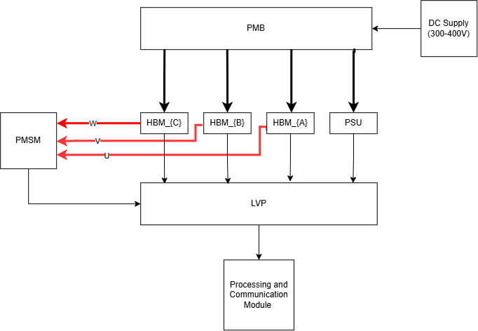
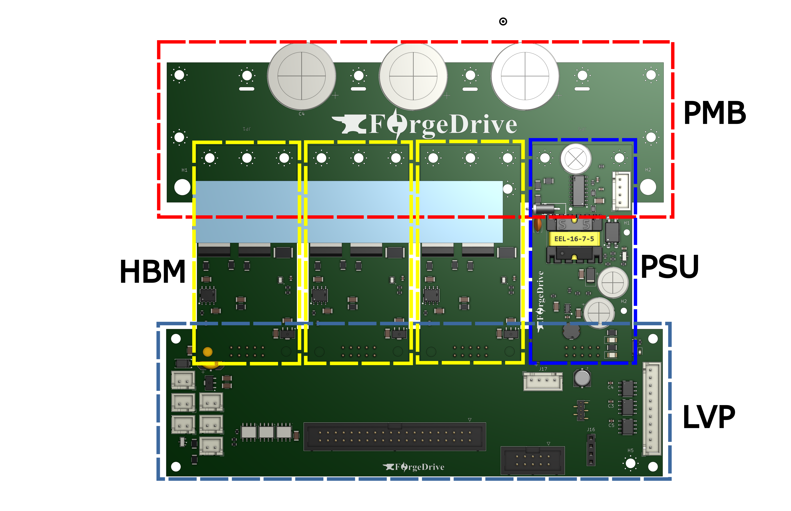
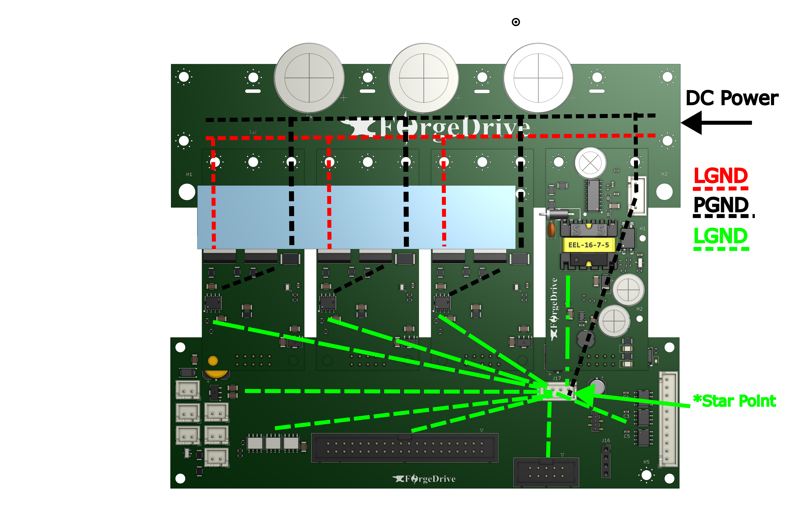
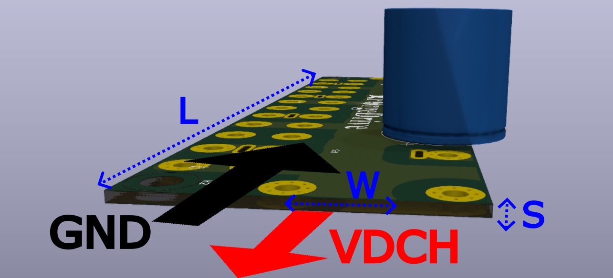
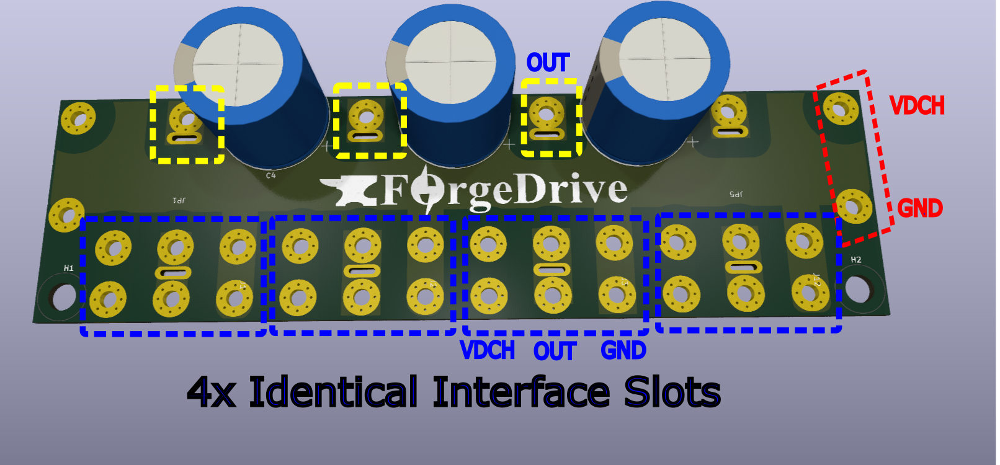
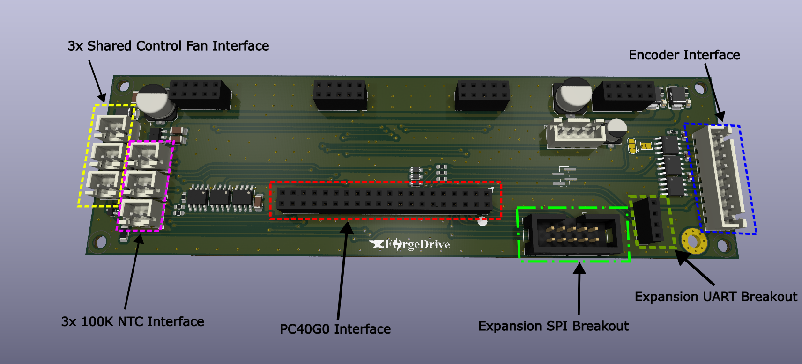
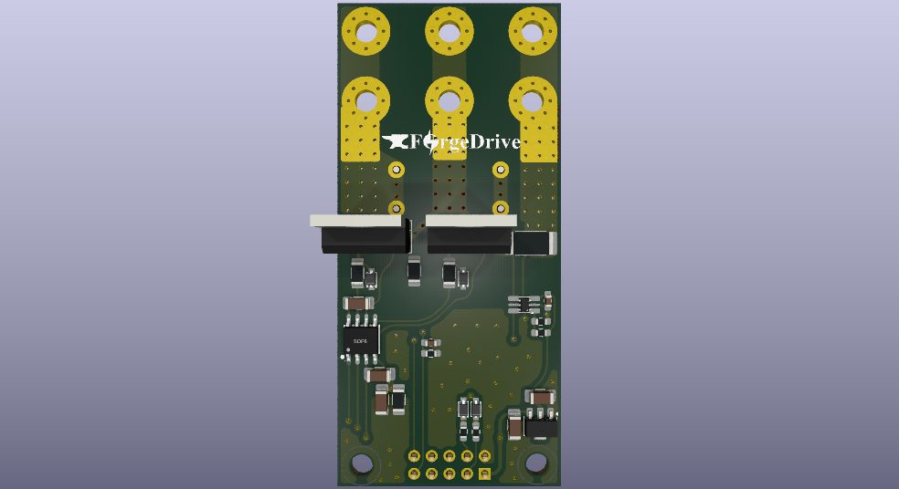
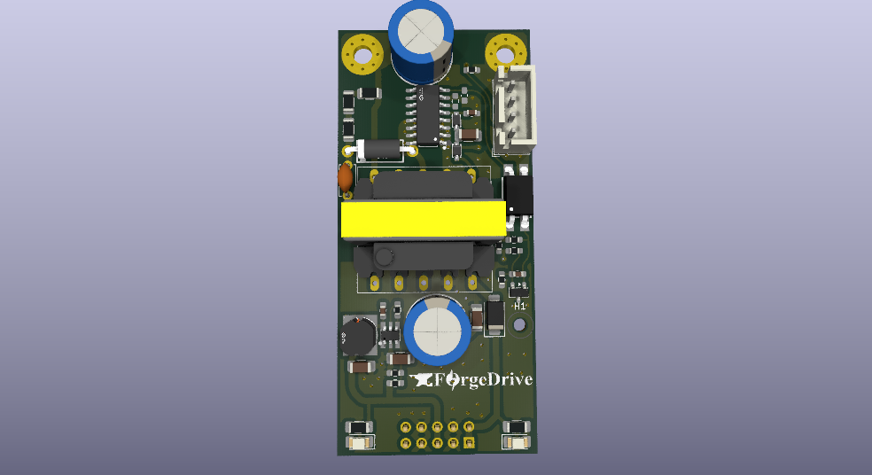

# ForgeX Gen0 — Three-Phase Inverter Hardware Architecture & Design
> **Project:** ForgeX
> **Generation:** Gen0
> **Document:** Three-Phase Inverter Hardware Architecture & Design
> **Author:** Omar Magdy
> **Revision:** Rev. 0
> **Status:** Development
> **Date:** August 2026

---

# 1. Introduction

## 1.1 Purpose

This document describes the architecture, design, implementation, and
validation of the ForgeX Gen0 three-phase inverter platform.

It documents the hardware architecture used to realize the first
ForgeX-generation power-conversion system, including its modular
partitioning, electrical interfaces, power stage, control and
measurement infrastructure, grounding strategy, PCB implementation,
mechanical integration, and protection mechanisms.

The purpose of this document is to provide a technical reference for
understanding how the ForgeX architectural principles are realized in
the Gen0 implementation, as well as to record the engineering decisions,
constraints, and trade-offs that shaped the design.

This document is intended to support continued development, maintenance,
debugging, reproduction, and future evolution of the hardware.

## 1.2 Gen0 Scope

ForgeX Gen0 implements a modular three-phase voltage-source inverter
intended primarily for motor-control and variable-speed drive
applications.

The system is composed of multiple functional hardware modules,
including the processing and development hardware, low-voltage signal
and control infrastructure, power-bus interconnection, auxiliary power
supply, and localized half-bridge power stages.

The Gen0 implementation provides the hardware infrastructure required
for three-phase power conversion, including:

- Three-phase power switching
- High-voltage DC-bus distribution
- Localized gate-drive and power-stage circuitry
- Phase-current measurement
- DC-bus voltage and other system measurements
- PWM control interfaces
- Encoder and position-sensing interfaces
- Fault and protection signaling
- Auxiliary low-voltage power
- External communication and expansion interfaces

Gen0 is primarily intended as a development and validation platform.
Its architecture is nevertheless designed to support practical
deployment and to provide a foundation for subsequent ForgeX
generations.

The scope of this document is limited to the Gen0 hardware
implementation. Firmware, control algorithms, application software,
and motor-control theory are discussed only where they directly affect
the hardware architecture or its interfaces.

## 1.3 Design Objectives

The ForgeX Gen0 hardware was developed with the following objectives:

- **Modularity** — Separate major engineering functions into
  self-contained hardware modules with defined interfaces.

- **Electrical Locality** — Keep high-current paths, high-\(di/dt\)
  switching loops, gate-drive paths, local decoupling, and other
  electrically sensitive structures physically localized.

- **Maintainability** — Keep modules accessible for inspection,
  probing, troubleshooting, modification, and replacement.

- **R&D Accessibility** — Provide practical access to measurement
  points, interfaces, signals, and hardware during development and
  validation.

- **Scalability** — Establish an architecture that can be extended
  to different power levels, configurations, and power-conversion
  topologies without requiring a completely independent hardware
  architecture.

- **Interface Stability** — Establish clearly defined electrical,
  mechanical, and functional interfaces between modules.

- **Performance** — Achieve the electrical performance required of a
  practical power-conversion system without allowing modularity to
  unnecessarily degrade switching, measurement, thermal, or power
  distribution characteristics.

- **Incremental Development** — Allow individual modules to be
  developed, tested, characterized, and revised independently.

- **Practical Deployment** — Maintain an architectural path from
  experimental hardware toward a maintainable and field-deployable
  system.

These objectives are treated as engineering requirements and
trade-offs rather than independent features. Where objectives conflict,
electrical performance, safety, reliability, and well-defined
architectural boundaries take precedence over modularity for its own
sake.

## 1.4 Relationship to the ForgeX Family

ForgeX Gen0 is the first hardware implementation of the ForgeX family
architecture.

It serves both as a functional three-phase inverter platform and as a
reference implementation through which the architectural principles
defined at the ForgeX family level are established and evaluated.

The Gen0 implementation realizes the ForgeX modular architecture
through a set of functional hardware modules, including the HBM, LVP,
PMB, PSU, and processing/development hardware.

The specific implementation of these modules, including component
selection, circuit topology, PCB layout, mechanical construction, and
interface details, is specific to Gen0 and is therefore documented
within this generation-level document.

Gen0 interfaces are intended to establish an initial compatibility
baseline for the ForgeX ecosystem. Future generations may preserve,
modify, replace, or extend these interfaces according to the
compatibility principles defined by the ForgeX family architecture.

Gen0 should therefore be regarded as both a complete inverter
implementation and the first architectural reference point for future
ForgeX generations.

---

# 2. Gen0 System Architecture

## 2.1 System Overview
ForgeX Gen0 modular three-phase voltage-source inverter designed
primarily for motor-control and variable-speed drive applications.

The system separates the processing and control domain from the
power-conversion hardware through a set of dedicated hardware modules.
The primary power path is established through the PMB, while individual
HBM modules provide the three localized half-bridge switching stages.

The LVP provides the low-voltage signal, measurement, sensing, and
control infrastructure required to interface the processing domain with
the power-stage hardware. The PSU provides the auxiliary low-voltage
power required by the control, signal, and power-stage subsystems.

The resulting architecture separates the major electrical concerns
while maintaining short and localized high-current and high-\(di/dt\)
paths within the power-stage modules.

At the system level, the principal functional domains are:

- **Processing** — real-time control, PWM generation, communications,
  and system-level coordination.
- **Low-voltage control and sensing** — signal conditioning,
  measurement, encoder interfaces, protection, and control interfaces.
- **Power distribution** — DC-bus distribution and interconnection
  between power-stage modules.
- **Power conversion** — three independent half-bridge stages forming
  the three-phase inverter.
- **Auxiliary power** — generation and distribution of the required
  low-voltage supply rails.

The modular arrangement allows the Gen0 inverter to be assembled from
independently developed subsystems while maintaining defined
electrical, mechanical, and functional interfaces between them.

## 2.2 Functional Block Diagram
The following diagram illustrates the principal functional relationships
between the ForgeX Gen0 hardware modules and the external system.

The diagram distinguishes the primary power path from control,
measurement, and communication paths and represents the architectural
boundaries between the major hardware subsystems.

The PMB establishes the common DC-bus infrastructure and provides the
physical interconnection through which the individual power-stage
modules are combined into the three-phase inverter.

The three HBM modules constitute the three switching legs of the
inverter. They receive their control signals from the low-voltage
control domain (LVP) while obtaining their primary power through the PMB.

The PSU supplies the auxiliary low-voltage rails required by the
ForgeX modules and associated control hardware.

The LVP provides the principal interface between the processing domain
and the power-stage hardware including measurement, encoder,
protection, and control-related interfaces.

# 3. Gen0 3-Phase Inverter Hardware Modules

The ForgeX Gen0 three-phase inverter is implemented as a collection of
functional hardware modules, each responsible for a defined portion of
the overall system.

The module boundaries follow the architectural principles established
by the ForgeX family: power conversion, power distribution, low-voltage
control, auxiliary power, and processing are separated into localized
and independently replaceable subsystems.

The following modules constitute the primary Gen0 hardware platform.
Detailed circuit design, PCB implementation, interfaces, constraints,
and validation results for each module are documented in the
corresponding sections.

## 3.1 LVP_G0S4

### Low-Voltage Plane — Gen0, 4 Slots

The LVP provides the primary low-voltage control and signal
interconnection infrastructure for the Gen0 system.

It interfaces the processing domain with the power-stage modules and
provides infrastructure for measurement, sensing, protection, encoder
interfaces, and other low-voltage signals.

The `S4` designation indicates the four-slot Gen0 implementation,
providing the physical interfaces required for the three HBM modules
and the associated auxiliary/power module connections.

The LVP is intentionally kept separate from the high-current power
conversion hardware, allowing the low-voltage control and sensing
infrastructure to evolve independently of the power stage.

## 3.2 PMB_G0S4VH4

### Power MotherBus — Gen0, 4 Slots, 400 V Class

The PMB provides the primary high-voltage power distribution
infrastructure of the Gen0 inverter.

The `S4` designation indicates four power-module interfaces, while
`VH4` identifies the 400 V-class voltage rating of the implementation.

The PMB distributes the DC bus to the three HBM modules and the PSU
while providing a centralized and mechanically organized power
interconnection structure.

The PMB is deliberately kept functionally simple in its fundamental
role: it provides the infrastructure through which the individual
power modules are combined into a complete converter. Where required,
additional functionality such as bus measurement, protection, or
precharge infrastructure can be introduced in future implementations
without changing the fundamental role of the PMB.

## 3.3 HBM_G0VH4C5

### Half-Bridge Module — Gen0, 400 V Class, 5 A

The HBM is the localized power-switching module of the ForgeX Gen0
inverter.

Each HBM implements one half-bridge of the three-phase inverter and
contains the associated power switching devices, gate-drive circuitry,
local measurement, protection, and supporting circuitry required to
operate the switching stage.

Three HBM modules are combined through the PMB to form the three
switching legs of the three-phase inverter.

The `VH4` designation identifies the 400 V-class implementation, while
`C5` identifies the 5 A current class.

The HBM is designed around electrical locality: high-current paths,
high-\(di/dt\) switching loops, gate-drive paths, current Sensing,
module output voltae sensing, and local decoupling are contained within 
the module rather than distributed across the wider system.

## 3.4 PSU_G0P20N

### Power Supply Module — Gen0, 20 W

The PSU provides the auxiliary low-voltage power required by the
ForgeX Gen0 system.

The `P20` designation identifies the nominal 20 W power class of the
module. The `N` suffix identifies an implementation with a dedicated
interface exposing the high-voltage DC-bus ground and a non-isolated
auxiliary low-voltage supply.

This interface allows the auxiliary supply reference to be connected
to the system grounding topology at a defined star point. In
non-galvanically-isolated LVP implementations, this provides a
controlled means of establishing the required common reference between
the auxiliary low-voltage domain and the DC-bus ground.

The PSU is treated as an independent subsystem so that auxiliary power
generation and regulation can be developed, tested, and revised
without requiring corresponding changes to the primary inverter
power-stage hardware.

The module provides the required supply rails to the low-voltage,
processing, and power-stage subsystems through the defined Gen0
interfaces.

## 3.5 BlackDev_G0Basic

### Processing / Development Module — STM32F401/F411

`BlackDev_G0Basic` is the primary processing and development module
used with the ForgeX Gen0 platform.

Rather than implementing a complete processing board, the
`BlackDev_G0Basic` is primarily a carrier and interface shield for
STM32F401/F411-based Black Pill development boards. It provides the
electrical and mechanical infrastructure required to integrate the
Black Pill into the ForgeX system while exposing the required ForgeX
interfaces to the remainder of the hardware.

The underlying Black Pill provides the primary microcontroller and its
associated basic support circuitry. `BlackDev_G0Basic` provides the
additional interconnection, signal routing, protection, connectors,
and development infrastructure required to integrate the processor
with the ForgeX Gen0 architecture.

This approach deliberately avoids unnecessarily reproducing a complete
microcontroller development platform within ForgeX. It allows the
processing element to remain inexpensive, widely available, easily
replaceable, and convenient to modify or experiment with during R&D.

The module provides the computational platform used for real-time
control, PWM generation, measurement processing, communication, and
system-level coordination.

The processing module communicates with the remaining ForgeX hardware
through defined low-voltage interfaces rather than requiring the
microcontroller itself to be physically integrated into the power
electronics.

The resulting separation also allows the underlying Black Pill to be
replaced or upgraded independently of the primary ForgeX power
hardware, provided the relevant processing and interface requirements
are maintained.

---

### Gen0 Module Overview

| Module | Role | Primary Rating / Characteristic |
|---|---|---|
| `LVP_G0S4` | Low-voltage control and signal infrastructure | 4-slot |
| `PMB_G0S4VH4` | High-voltage power distribution | 4-slot, 400 V class |
| `HBM_G0VH4C5` | Half-bridge power stage | 400 V class, 5 A |
| `PSU_G0P20N` | Auxiliary power | 20 W |
| `BlackDev_G0Basic` | Processing / development | STM32F401/F411 |

These modules form the baseline Gen0 hardware ecosystem. The following
sections describe their individual electrical architectures,
interfaces, PCB implementation, design constraints, and validation.

# 4. System Level Layout and Design 

## 4.1 Power Distribution Network (PDN) and Grounding Scheme

The ForgeX Gen0 system employs a bus-like power distribution structure,
with the primary DC-bus interconnection centralized at the PMB.

The power modules are connected directly to the common DC-bus structure,
minimizing the length and inductance of the high-current power paths.
This approach reduces parasitic DC-bus inductance and consequently
reduces the voltage developed across the distribution network during
rapid current transients:

\[
V_L = L\frac{di}{dt}
\]

Minimizing this parasitic inductance is particularly important for the
high-\(di/dt\) switching currents generated by the HBM power stages.
The resulting reduction in parasitic voltage excursion helps limit
switching-node overshoot, ringing, and associated electromagnetic
interference.

The grounding architecture follows the same principle. Power and
low-voltage reference connections are organized around a defined
system grounding point at the power entry, with the relevant module
returns arranged to minimize unwanted circulating currents and shared
impedance.

This star-oriented grounding strategy reduces common impedance between
high-current power paths and sensitive control and measurement
references. Consequently, voltage disturbances produced by switching
currents are less likely to appear as ground bounce at sensitive
interfaces.

Together, the low-inductance power distribution and controlled
grounding topology provide a defined current-return structure for the
system and help reduce parasitic coupling, common-mode disturbances,
and electromagnetic interference.

---

# 5. Module Level Overview and External Interfaces

## 5.1 PMB_G0S4VH4 Brief

**Revision:** revA  
[Design Files](https://github.com/Omar-Magdy0/ForgeDriveHW/tree/main/ForgeX/PMB_G0S4VH4/revA)
[Schematic](https://github.com/Omar-Magdy0/ForgeDriveHW/blob/main/ForgeX/PMB_G0S4VH4/revA/Doc/PMB_G0S4VH4.pdf)
**Technical Reference** (*Work in Progress🛠️*)

The PMB employs a biplanar laminated DC-bus structure in place of the
originally considered coplanar bus arrangement. The change was primarily
motivated by the lower parasitic inductance of the biplanar structure,
with the additional objective of reducing high-frequency voltage
disturbances, electromagnetic interference, and inter-module ground
potential variation.

The resulting bus geometry provides a relatively short and tightly
coupled current loop. For the farthest module, corresponding to a
maximum bus path length of approximately 15 cm, width of 10mm and 
spacing of 1.6mm, the analytical worst-case loop inductance is estimated 
at approximately 30 nH for the implemented geometry. 
This estimate is based on the biplanar bus geometry and the corresponding 
calculation provided by the EMI Software biplanar bus calculator:

[EMI Software — Biplanar Bus Inductance Calculator](https://www.emisoftware.com/calculator/biplanar/)

Distributed DC-link capacitors are placed in close proximity to the
individual power modules. This reduces the effective high-frequency
current-loop area and minimizes the amount of switching current that
must flow through the main DC-bus structure. Local placement also
reduces the effective parasitic ESL seen by each HBM during switching
transients.

For the farthest module, the estimated equivalent series resistance
(ESR) of the DC-link path from the module to the primary DC input
terminal is below 10 mOhm.

The PDN was designed with explicit limits on both resistive and
inductive disturbances. Under the nominal 1 kW, 400 V operating
condition, the expected DC common-mode voltage variation between
modules is targeted at less than 50 mV, while inductively induced
ground-bounce voltage is targeted at less than 200 mV.

These limits were used as design targets for the PMB geometry,
distributed DC-link capacitance, grounding topology, and physical
placement of the power modules.

The connector pad matrix serves a dual purpose as both the high-current
electrical termination for the module and its primary mechanical
fixation interface. M3 copper or brass spacers are used as the
mechanical fastening elements and, where electrically connected,
provide a low-impedance current path between the module and the PMB.

The fastening arrangement is designed for firm mechanical clamping to
maintain low and stable contact resistance while providing sufficient
mechanical rigidity for the assembled power structure.

---

## 5.2 LVP_G0S4 Brief

**Revision:** revA  
[Design Files](https://github.com/Omar-Magdy0/ForgeDriveHW/tree/main/ForgeX/LVP_G0S4/revA)
[Schematic](https://github.com/Omar-Magdy0/ForgeDriveHW/blob/main/ForgeX/LVP_G0S4/revA/Doc/LVP_G0S4.pdf)
**Technical Reference** (*Work in Progress🛠️*)

The `LVP_G0S4` implements the primary low-voltage control, signal
conditioning, sensing, and expansion infrastructure of the ForgeX Gen0
platform.

The current revision exposes the following primary feature set.

### Encoder Interfaces

The LVP provides native physical-layer support for several encoder
interface types, allowing the same hardware platform to accommodate
different feedback technologies without requiring changes to the
primary processing hardware.

Supported interfaces include:

- SSI
- BiSS-C
- A/B/Z quadrature encoders
- Differential Hall-effect encoder signals

The encoder interfaces are routed through the LVP's low-voltage signal
infrastructure and are presented to the processing domain through the
defined system interfaces.

### Processing and Communication (PC40G0) Interface 

The `LVP_G0S4` PC40G0 Interface exposes a packed 40-pin system connector carrying the
primary low-voltage signals exchanged between the processing domain,
power-stage modules, sensor interfaces, and communication hardware.

The connector consolidates the principal digital and analog signals
required for system integration while maintaining a defined interface
between the LVP and the remainder of the ForgeX hardware.

### Expansion Interfaces

The LVP provides multiple expansion interfaces, including:

- Expansion SPI
- Expansion UART

These interfaces are intended to support distributed functionality
within the ForgeX architecture.

Rather than requiring every function to remain directly connected to
the primary processor, future implementations may assign specialized
responsibilities to additional devices or modules. Examples include
dedicated encoder-interface devices, intelligent gate-driver
controllers, distributed measurement devices, or other specialized
peripherals.

This provides a path toward increasing system capability without
requiring a corresponding increase in complexity on the primary
processing module.

### Temperature and Fan Interfaces

The LVP provides three channels of 100 kOhm NTC temperature-sensor signal
conditioning for monitoring temperatures at multiple locations within
the system.

Three fan interfaces are also provided. In the Gen0 implementation,
the fan outputs are currently controlled through a common control
scheme rather than independently controlled channels.

The interfaces provide the basic infrastructure required for thermal
management while leaving room for more sophisticated fan-control
strategies in future generations.

### High-Speed Overcurrent Protection

The LVP implements three high-speed comparator channels for
overcurrent protection.

The comparator paths are designed for a response time below
approximately 150 ns and provide a hardware-level protection path
independent of normal firmware execution.

The resulting fault signals are forwarded to the MCU timer break-input
path (`~BKIN`), allowing the PWM hardware to rapidly disable the power
stage following detection of an overcurrent condition.

This architecture provides a fast protection mechanism while keeping
the protection decision outside the normal software control loop.

### High-Speed Digital Layout

The LVP PCB layout is designed around the electrical requirements of
its high-speed digital interfaces.

Digital interfaces are primarily routed toward the right-hand side of
the board, maintaining a defined signal-flow direction and minimizing
unnecessary crossings through unrelated circuit regions.

High-speed signal traces are routed over continuous reference planes
where practical, avoiding interruptions in the return-current path and
minimizing unnecessary loop area.

The layout was developed with a target of supporting approximately
10 MHz BiSS-C operation and 40 MHz SPI operation without significant
signal degradation under the intended interconnect conditions.

These frequencies represent design targets rather than guaranteed
maximum interface rates; final achievable performance depends on the
connected devices, trace geometry, connector characteristics,
termination, loading.

## 5.3 HBM_G0VH4C5 Brief

**Revision:** revA  
[Design Files](https://github.com/Omar-Magdy0/ForgeDriveHW/tree/main/ForgeX/HBM_G0VH4C5/revA)
[Schematic](https://github.com/Omar-Magdy0/ForgeDriveHW/blob/main/ForgeX/HBM_G0VH4C5/revA/Doc/HBM_G0VH4C5.pdf)
**Technical Documentation:** *Work in Progress🛠️ *

The `HBM_G0VH4C5` (Half-Bridge Module) implements one switching
leg of the ForgeX Gen0 three-phase inverter.

The module integrates the power switching devices, gate-drive
circuitry, current measurement, switch-node voltage measurement, and
the supporting protection and control circuitry required to operate
the half-bridge as a self-contained power-stage module.

The HBM is responsible for controlling the switching state of its
power devices to perform the power modulation required by the
inverter. The `Gen0 VH4C5` implementation uses a low-side shunt for output
current measurement and provides switch-node voltage measurement for
monitoring and control purposes.

A primary design objective of the HBM is to maintain **electrical
locality** within the power stage. High-\(di/dt\) switching paths,
gate-drive paths, local DC-link connections, and associated return
paths are kept physically compact in order to minimize parasitic
inductance, switching-loop area, and unwanted coupling between the
power and control domains.

The module interfaces with the PMB through the defined high-current
power-module interface and exposes a low-voltage control and
measurement interface toward the LVP.

Three HBM modules are combined through the `PMB_G0S4VH4` to form the
three switching legs of the ForgeX Gen0 three-phase inverter.

The HBM therefore establishes the primary boundary between the
high-energy switching domain and the low-voltage control and
measurement infrastructure of the ForgeX architecture.

---

## 5.4 PSU_G0P20N Brief

**Revision:** revA  
[Design Files](https://github.com/Omar-Magdy0/ForgeDriveHW/tree/main/ForgeX/PSU_G0P20N/revA)
[Schematic](https://github.com/Omar-Magdy0/ForgeDriveHW/blob/main/ForgeX/PSU_G0P20N/revA/Doc/PSU_G0P20N.pdf)
**Technical Documentation** (*Work in Progress🛠️*)

The `PSU_G0P20N` provides the auxiliary low-voltage power required by
the ForgeX Gen0 platform. The module is designed with galvanic
isolation between the primary high-voltage input domain and its main
low-voltage outputs.

For the current Gen0 implementation, the primary auxiliary outputs
exposed by the module are **12 V and 5 V**, providing the supply rails
required by the ForgeX control, processing, and supporting circuitry.

Although the auxiliary outputs are galvanically isolated by design, the
PSU also exposes the high-voltage power-domain ground through a
dedicated interface. This allows the isolation boundary to be
selectively bridged where required by the system architecture.

In particular, this provides a controlled grounding option for
non-galvanically-isolated LVP implementations, where the auxiliary
low-voltage reference may be intentionally tied to the system power
ground at the defined grounding point.

The PSU therefore supports both isolated and selectively
non-isolated system configurations without requiring a fundamentally
different auxiliary power module.

---

# 🛠️UNDER DEVELOPMENT🛠️

**Sections Under are mainly still to be implemented**

---

# 10. Validation and Bring-Up

## 10.1 Initial Bring-Up

## 10.2 Low-Voltage Testing

## 10.3 Gate-Drive Validation

## 10.4 PWM Validation

## 10.5 ADC / Measurement Validation

## 10.6 Switching Validation

## 10.7 Thermal Validation

## 10.8 Protection Validation

## 10.9 Motor Testing

---

# 11. Known Issues and Limitations

## 11.1 Known Hardware Issues

## 11.2 Performance Limitations

## 11.3 Documentation Gaps

## 11.4 Mechanical Assembly

---

# 13. Future Development

## 13.1 Gen0 Improvements

## 13.2 Potential Gen1 Changes

## 13.3 Interface Evolution

## 13.4 Performance Improvements

## 13.5 Additional Modules

---

# 14. Revision History