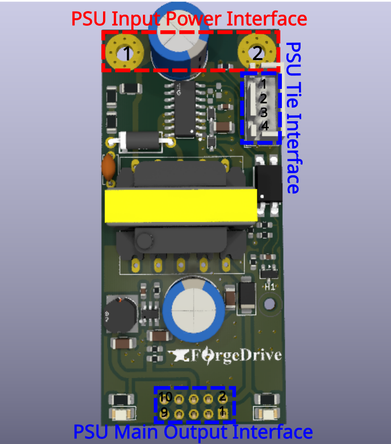
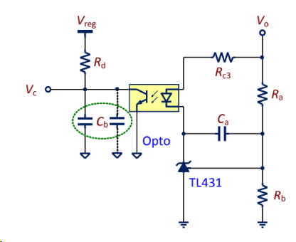
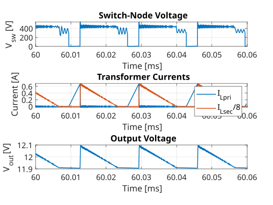
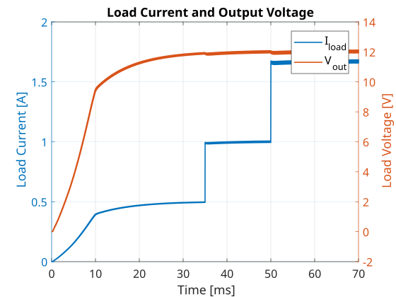
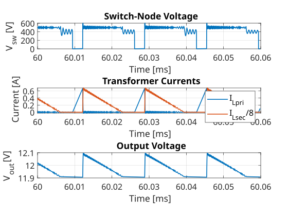
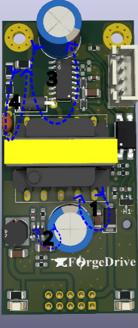

---
toc:
  depth_from: 1
  depth_to: 3
export_on_save:
  prince: true
---

@import "../../forgex_doc_style.css"

# PSU_G0P20N Technical Reference

> **Project:** ForgeX  
> **Generation:** Gen0
> **Document:** PSU_G0P20N Technical Reference  
> **Author:** Omar Magdy  
> **Revision:** Rev. 0  
> **Status:** Development  
> **Date:** August 2026

## Table of Contents
[TOC]

## 1. Introduction

The **PSU (Power Supply Module)** provides the localized low-voltage auxiliary power required by the ForgeX platform. It converts the system **high-voltage DC link**, nominally in the \(340\text{–}400\,\mathrm{VDC}\) range, into regulated low-voltage supplies for downstream electronics and auxiliary circuitry.

The PSU provides the electrical boundary between the VDCH power domain and the low-voltage electronics domain. In addition to power conversion, the module incorporates the local functions required for controlled startup, protection, output regulation, and DC-link voltage monitoring.

The **Gen0 implementation**, `PSU_G0P20N`, establishes the initial electrical, mechanical, and interface definition for the ForgeX PSU family. Subsequent PSU generations may revise the power-conversion topology, switching devices, magnetics, control and regulation architecture, protection mechanisms, or thermal implementation while maintaining the defined ForgeX module interfaces where generational compatibility is required.

The Gen0 design is intentionally optimized for a relatively low-power auxiliary supply, with emphasis on simple magnetics, component availability, ease of debugging, and predictable behavior under the intended ForgeX operating conditions.

---

### 1.1 Naming

`PSU_G0P20N` follows the ForgeX module naming convention:

* `PSU` — Power Supply Module
* `G0` — Generation 0
* `P20` — 20 W nominal power class
* `N` — Non-isolated auxiliary/tie interface variant

The `N` suffix denotes that the module exposes the internal auxiliary supply and the power-side reference through a dedicated **tie interface**. This allows the module to be used in configurations where:

* the internal auxiliary supply is used on the `PGND` side;
* the PSU output-side ground is intentionally referenced to `PGND`;
* the low-voltage outputs are used in a non-galvanically-isolated system configuration

The `P20` designation identifies the intended **power class** of the module and should not be interpreted as an unconditional continuous-power rating. The achievable output power and current depend on operating conditions including:

* VDCH input voltage
* ambient and component temperature
* transformer and semiconductor losses
* PCB thermal characteristics
* enclosure and cooling conditions
* output-voltage loading

---

### 1.2 Functional Overview

The PSU accepts the ForgeX `VDCH` bus as its primary input and generates regulated low-voltage auxiliary supplies for downstream electronics.

The principal functions of the PSU are:

* Generate the primary \(12\,\mathrm{V}\) auxiliary supply.
* Generate the \(5\,\mathrm{V}\) auxiliary supply.
* Provide the required startup and power-conversion functions.
* Provide local protection against abnormal operating conditions.
* Provide output-side monitoring and regulation.
* Provide conditioned measurement of the VDCH bus voltage.
* Provide the required power and signal interfaces to downstream ForgeX modules.
* Maintain the required galvanic isolation between the `VDCH`/power domain and the low-voltage domain for configurations requiring an isolated output.

The module follows the ForgeX design principle of **electrical locality**: functions associated with a power domain are implemented locally within the module rather than being distributed across unrelated system modules.

This includes:

* Power conversion and regulation
* Startup and auxiliary-power generation
* Output monitoring
* Overload and short-circuit protection
* Thermal protection where applicable
* VDCH bus-voltage conditioning
* Local filtering and energy storage

The conditioned VDCH measurement is particularly relevant to applications such as motor drives and power converters, where the controller may require knowledge of the instantaneous DC-link voltage for functions including duty-cycle calculation, modulation limits, protection, or supervisory monitoring.

### 1.3 Design Files

The complete hardware design files for this module are maintained in the ForgeX repository:

**revA:**
- [PCB & Schematic](https://github.com/Omar-Magdy0/ForgeDriveHW/tree/main/ForgeX/PSU_G0P20N/revA)
- [Simulation](https://github.com/Omar-Magdy0/ForgeDriveHW/tree/main/ForgeX/PSU_G0P20N/revA/Doc/simulation)
- **Manufacturing files:** 🛠️

---

## 2. Interfaces & I/O

The PSU interfaces with the ForgeX system through dedicated **VDCH power**, **low-voltage output**, and **auxiliary/tie** interfaces.

The interfaces are intentionally separated according to their electrical function and power domain.

### 2.1 PSU Input Power Interface

The VDCH input interface provides the primary energy input to the PSU. The interface uses dedicated high-current copper terminals suitable for connection to the ForgeX DC-link distribution structure.

The positive terminal is connected to the system VDCH positive rail, while `PGND` provides the corresponding DC-link return and power-domain reference.

| Pin Number | Pin Name | Pin Description                                             |
| ---------: | -------- | ----------------------------------------------------------- |
|          1 | `VDCH`    | Positive VDCH input. Connects to the positive DC-link rail. |
|          2 | `PGND`   | VDCH return and primary power-domain reference.             |

The input interface shall be treated as a **hazardous-voltage interface** when the PSU is connected to the ForgeX VDCH bus.

---

### 2.2 PSU Main Output Interface

The main output interface provides the regulated low-voltage supplies generated by the PSU.

The interface exposes both \(12\,\mathrm{V}\) and \(5\,\mathrm{V}\) rails together with their corresponding low-voltage ground reference, `LGND`.

The PSU Main Output interface uses a 2.54 mm-pitch header and is compatible with standard IDC and Dupont-style connectors. Multiple pins are paralleled for the power rails and return paths to reduce contact resistance and distribute current across multiple contacts.

A long-pin Dupont header may be used where access to the module's top-layer debug and test points is required.

| Pin Number | Pin Name | Pin Description                               |
| ---------: | -------- | --------------------------------------------- |
|        1–2 | `12V`    | Regulated \(12\,\mathrm{V}\) low-voltage output. |
|        3–4 | `LGND`   | Low-voltage output return/reference.          |
|        5–6 | `5V`     | Regulated \(5\,\mathrm{V}\) low-voltage output.  |
|        7–8 | `LGND`   | Low-voltage output return/reference.          |
|       9–10 | `NC`     | No electrical connection.                     |

`LGND` represents the low-voltage output reference and is electrically distinct from `PGND` in galvanically isolated configurations. In non-isolated configurations, `LGND` and `PGND` may be intentionally referenced together through the system-level grounding/tie arrangement.

---

### 2.3 PSU Non-Isolated Tie Interface

The `N` variant provides a dedicated auxiliary/tie interface exposing selected internal nodes that are not available through the main output connector.

The Non-Isolated Tie interface uses `JST-XH` 2.5 mm-pitch connectors.

This interface permits the PSU to be integrated into systems where the low-voltage auxiliary supply or its reference must be associated with the primary power domain.

| Pin Number | Pin Name           | Pin Description                                                        |
| ---------: | ------------------ | ---------------------------------------------------------------------- |
|          1 | `Internal Aux 12V` | Internal \(12\,\mathrm{V}\) auxiliary output, limited to \(<5\,\mathrm{W}\). |
|          2 | `VDCH_CND`         | Conditioned VDCH bus-voltage measurement output.                       |
|          3 | `PGND`             | Primary power-domain reference.                                        |
|          4 | `PGND`             | Primary power-domain reference.                                        |

`VDCH_CND` is a conditioned analog representation of the `VDCH` DC-link voltage after the PSU's internal voltage-conditioning network. It is intended for connection to a suitable low-voltage ADC or monitoring circuit.

The `PGND` connection on this interface provides access to the primary power-domain reference and shall only be connected according to the intended system-level grounding architecture.

---

## 3. Design Requirements

The Gen0 PSU is designed around the following primary requirements:

* **VDCH input:** \(340\text{–}400\,\mathrm{VDC}\) nominal operating range.
* **Power class:** \(5\text{–}20\,\mathrm{W}\) output operation.
* **Nominal auxiliary rails:** \(12\,\mathrm{V}\) and \(5\,\mathrm{V}\).
* **Efficiency:** \(\geq 85%\) under the intended nominal operating condition.
* Provide controlled startup from the VDCH bus.
* Provide appropriate overload and short-circuit protection.
* Provide regulated low-voltage outputs suitable for ForgeX downstream electronics.
* Provide conditioned VDCH-bus voltage measurement.
* Maintain the required electrical isolation or intentional non-isolated relationship according to the selected system configuration.
* Provide sufficient thermal margin for continuous operation within the intended power class.

The \(20\,\mathrm{W}\) designation represents the intended Gen0 design power class. Detailed continuous-load capability shall be evaluated against the thermal limits of the transformer, switching devices, rectification components, PCB copper, and other dissipative elements.

---

## 4. Constraints

The Gen0 PSU design is subject to several practical constraints.

A significant constraint is the limited local supply chain, with
component availability primarily governed by vendors accessible in
Egypt. Component selection therefore considers availability and
replacement options in addition to electrical performance.

PCB fabrication is constrained by the DFM rules applicable to the
available fabrication process:

* Maximum number of layers: 2
* Minimum track width: 0.25 mm
* Minimum clearance: 0.25 mm
* Minimum polygon-pour clearance: 0.3 mm
* Minimum via diameter: 0.9 mm
* Minimum via hole diameter: 0.4 mm
* Minimum annular ring: 0.5 mm
* Maximum single-board size: 38 cm × 28 cm
* Maximum double-board size: 28 cm × 22 cm

The Gen0 implementation additionally prioritizes:

* Cost effectiveness
* Component availability
* Electrical and mechanical simplicity
* Reliability
* Predictable startup and protection behavior
* Ease of debugging and characterization
* Ease of modification during development
* Maintainability
* Simple and reproducible magnetics
* Compatibility with the broader ForgeX module architecture

Because the PSU interfaces directly with the VDCH bus, the Gen0 implementation also places particular emphasis on controlled voltage stress, switching-node behavior, insulation/isolation requirements where applicable, creepage and clearance, and safe probing during development and validation.

---

## 5. Sizing and Component Selection

This section documents the principal component-selection and sizing decisions of the Gen0 PSU. Component values are selected from the electrical requirements established in the preceding sections, together with the operating characteristics of the selected switching topology and power devices.

Where analytical sizing is insufficient to capture parasitic effects or nonlinear device behavior, the initial component values are supplemented by simulation and experimental characterization.

### 5.1 Off-line Switcher

The **VIPer26** off-line switcher from the STMicroelectronics VIPerPlus family was selected as the primary switching controller and integrated power device.

**Datasheet:** [VIPer26LD](https://www.st.com/resource/en/datasheet/VIPER26.pdf)

**Selection rationale:**

* **Local availability and cost:** The device is readily available from local suppliers at relatively low unit cost, making it practical for prototyping, production, and replacement.
* **Integrated high-voltage MOSFET:** The integrated MOSFET provides an \(800\,\mathrm{V}\) maximum drain-source voltage rating, providing substantial voltage margin relative to the intended `VDCH` operating range and associated switching transients.
* **Application-appropriate conduction characteristics:** The integrated MOSFET has an on-state resistance in the order of \(7\,\Omega\), which is suitable for the relatively low primary current associated with the \(5\text{–}20\,\mathrm{W}\) PSU power class.
* **Low switching-node capacitance:** The relatively low effective output capacitance of the integrated MOSFET reduces switching-node capacitive energy and associated switching losses.
* **Integrated control and protection:** The device integrates startup, PWM control, current limiting, burst-mode operation, and associated protection functions.
* **Integrated current sensing:** Primary current is sensed internally through the integrated SenseFET structure, eliminating the need for a conventional external primary-side current-sense resistor.
* **Frequency jittering:** The integrated switching-frequency jitter function reduces the concentration of switching energy at a single frequency and can reduce EMI peaks.
* **Low standby consumption:** Integrated low-power operating modes reduce consumption under light-load conditions.

The integrated switching, control, sensing, startup, and protection functions result in a compact implementation with substantially reduced external component count.

Although the application is not a conventional mains-powered offline supply, the input-voltage range and required operating conditions are within the intended application domain of the device. The VIPer26 therefore provides a suitable integrated switching solution for the ForgeX PSU.

The Gen0 implementation follows the **isolated flyback application topology** presented in the VIPer26 datasheet.

### 5.2 Flyback Transformer

The flyback transformer is the primary energy-storage, energy-transfer, and
galvanic-isolation element of the PSU.

Unlike a conventional power transformer, the flyback transformer stores a
substantial fraction of the transferred energy in its magnetizing inductance
during the primary conduction interval and subsequently transfers this energy
to the secondary during the demagnetization interval.

The design methodology follows the general procedure described in
[Designing a DCM flyback converter](https://www.ti.com/lit/ta/ssztcw6/ssztcw6.pdf?ts=1787114658344&ref_url=https://www.google.com/),
with modifications to the order and priority of the design constraints to
reflect the requirements of the ForgeX PSU.

The transformer design is constrained by:

* `VDCH` operating-voltage range
* Required output power
* Selected switching frequency
* Maximum primary peak current
* Target operating mode
* Allowable flux density
* Required primary magnetizing inductance
* Selected turns ratio
* Allowable leakage inductance
* Winding current density
* Insulation and creepage requirements
* Thermal constraints

The transformer design establishes the primary magnetizing inductance,
maximum stored energy per switching cycle, reflected secondary voltage,
MOSFET voltage stress, secondary-device voltage stress, and the resulting
flyback operating regime.

The initial electrical parameterization is performed before physical core
and winding selection. The resulting electrical requirements are then passed
to the magnetic design stage, where the core, number of turns, air gap,
winding geometry, leakage inductance, and thermal characteristics are
determined.

The \(150\,\mathrm{V}\) maximum reflected-voltage constraint is selected
from the available voltage margin of the VIPer26 integrated MOSFET.

At the maximum VDCH input voltage, the idealized MOSFET drain-source voltage
is approximately:

\[
V_{DS} \approx V_{in,max} + V_R
\]

Additional voltage stress is introduced by leakage-inductance-induced
switching overshoot. For the initial design, a \(100\,\mathrm{V}\) allowance
is reserved for this overshoot:

\[
V_{DS,max}
\approx
400\,\mathrm{V}
+
150\,\mathrm{V}
+
100\,\mathrm{V}
=
650\,\mathrm{V}
\]

This provides an initial voltage margin below the \(800\,\mathrm{V}\) MOSFET
rating. The actual leakage-induced overshoot and resulting voltage margin
are subsequently verified using the final transformer leakage inductance
and RCD clamp design.

#### Primary Inductance and Turns Ratio

The initial flyback electrical parameterization is performed by first
establishing the reflected-voltage constraint and turns ratio, followed by
selection of the maximum operating duty cycle and corresponding primary peak
current.

\[
\begin{aligned}
f_{sw} &= 60\,\mathrm{Khz} \quad \text{(Switcher fixed switching frequency)}
\\[4pt]
V_{R_{max}} &= 150\,\mathrm{V} \quad \text{(Maximum tolerable secondary-to-primary reflected voltage)}
\\[4pt]
\frac{N_p}{N_s} &= 8
\\[4pt]
V_R &= (V_{out}+V_d)\times\frac{N_p}{N_s} = 99.2\,\mathrm{V}
\\[4pt]
I_{lim} &= 0.7\,\mathrm{A} \quad \text{(Controller peak-current limit)}
\end{aligned}
\]

For DCM operation, the switching period consists of three distinct
intervals:

\[
\begin{aligned}
T_s &= \frac{1}{f_{sw}} = 16.67\,\mu\mathrm{s}
\\[4pt]
T_s &= t_{1}+t_{2}+t_{3}
\\[4pt]
T_s &> t_{1}+t_{2}
\\[4pt]
D &= \frac{t_{1}}{T_s}
\end{aligned}
\]

where:

\[
\begin{aligned}
t_{1} &: \text{Primary switch ON; magnetizing current ramps up.}
\\[4pt]
t_{2} &: \text{Primary switch OFF; secondary conducts and transfers stored energy.}
\\[4pt]
t_{3} &: \text{Both primary and secondary currents are zero.}
\end{aligned}
\]

The boundary between DCM and CCM occurs when the demagnetization interval exactly occupies the remainder of the switching period:

\[
\begin{aligned}
D_{crit} &= \frac{V_R}{V_{in,min}+V_R} = \frac{99.2}{340+99.2} \approx0.226
\end{aligned}
\]

The maximum operating duty cycle is selected below this boundary to maintain DCM operation at the minimum `VDCH` input voltage:

\[
D_{max}\approx0.2
\]

Therefore:

\[
D_{max}<D_{crit}
\quad\text{(DCM operation at }V_{in,min}\text{)}
\]

With the maximum duty cycle selected as a design constraint, the required
primary peak current is determined from the desired output power:

\[
\begin{aligned}
P_{out}&=20\,\mathrm{W}
\\[4pt]
\eta&=0.85
\\[4pt]
I_{pk}&=\frac{2P_{out}}{\eta V_{in,min}D_{max}}\approx0.692\,\mathrm{A}
\end{aligned}
\]

The required primary magnetizing inductance is then selected to store the
required energy per switching cycle at the selected peak current:

\[
L_m=\frac{2P_{out}}{\eta I_{pk}^2f_{sw}}\approx1.6\,\mathrm{mH}
\]

The resulting peak current remains below the controller current limit:

\[
I_{pk}<I_{lim}
\]

The resulting \(L_m\), \(I_{pk}\), \(D_{max}\), and turns ratio are passed to
the subsequent magnetic design stage.

#### Magnetics Design

The practical design of the flyback transformer follows the procedure
presented in Fairchild application note
[AN-4140 — Transformer Design Consideration for Offline Flyback Converters Using Fairchild Power Switch FPS](https://www.academia.edu/8900999/AN_4140_Transformer_Design_Consideration_for_Offline_Flyback_Converters_Using_Fairchild_Power_Switch_FPS).

The transformer is designed around the previously established electrical
requirements, including the primary magnetizing inductance, peak primary
current, switching frequency, turns ratio, reflected voltage, and required
DCM operating range.

##### Core Selection

An `6H20 EE22` ferrite core from
[FDK's ferrite core catalogue](https://www.es.co.th/Schemetic/PDF/FDK-FERRITE.PDF)
is selected as the initial magnetic core for the Gen0 transformer.

The selected core provides the required magnetic cross-sectional area and
winding window for the intended \(20\,\mathrm{W}\) flyback application.

The transformer is operated with an intentional air gap to establish the
required magnetizing inductance and to store the majority of the flyback
energy in the magnetic circuit.

##### Primary and Secondary Turns

The required primary turns are initially determined from the required
magnetizing inductance and the allowable peak flux density.

**Equation 1 — Minimum Primary Turns**

\[
N_P^{min}=\frac{L_m I_{over}}{B_{sat}A_e}\times10^6
\qquad(\text{turns})
\]

where \(L_m\) is the required primary magnetizing inductance,
\(I_{over}\) is the maximum primary current used for the magnetic design,
\(B_{sat}\) is the selected saturation flux-density limit, and \(A_e\) is
the effective magnetic cross-sectional area of the core.

The resulting minimum primary-turn requirement is:

\[
N_P^{min}\approx80
\qquad(\text{turns})
\]

The secondary winding turns are determined from the required output voltage
and the selected primary-to-secondary turns ratio.

**Equation 2 — Secondary Winding Turns**

\[
N_{s1} = \frac{N_p}{8} 
\]

For the Gen0 \(12\,\mathrm{V}\) output winding, the resulting winding is:

\[
N_{s(n)}=10
\qquad(\text{turns})
\]

The auxiliary winding is similarly determined from the required auxiliary
supply voltage.

**Equation 3 — Auxiliary Winding Turns**

\[
N_a=\frac{V_{cc}^*+V_{Fa}}{V_{o1}+V_{F1}}\cdot N_{s1}
\]

with:

\[
V_{cc}^*=15\,\mathrm{V}
\]

giving:

\[
N_a=12
\qquad(\text{turns})
\]

The resulting winding arrangement is therefore based on approximately
\(80\) primary turns, \(10\) secondary turns, and \(12\) auxiliary turns.

##### Air Gap

The required effective air gap is determined from the target magnetizing
inductance and the magnetic core \(A_L\) value.

**Equation 4 — Air Gap Length**

\[
G=40\pi A_e\left(\frac{N_P^2}{1000L_m}-\frac{1}{A_L}\right)
\]

For the selected core and target magnetizing inductance, the calculated
effective gap is approximately:

\[
G=0.2\,\mathrm{mm}
\]

The final physical gap is established during magnetic construction and
verified by measuring the resulting primary inductance. The magnetic
inductance measurement is used as the final validation of the implemented
air gap rather than relying solely on the calculated mechanical gap.

##### Winding Conductor Sizing

The winding conductors are sized according to the calculated RMS winding
currents and the selected allowable copper current density.

For the primary winding, a current density of approximately
\(5\,\mathrm{A/mm^2}\) is used.

The primary RMS current is estimated from the peak current and maximum
primary conduction duty:

\[
I_{pk,rms}=I_{pk}\sqrt{\frac{D_{max}}{3}}\approx170\,\mathrm{mA}
\]

For the secondary winding, a current density of approximately
\(6\,\mathrm{A/mm^2}\) is used.

The secondary conduction interval is determined from the primary conduction
interval and the applied primary and reflected secondary voltages:

\[
t_2=\frac{t_1V_{in}}{(V_{out}+V_d)\frac{N_p}{N_s}}
\]

Using the selected operating point:

\[
t_2=\frac{\frac{0.2}{60k}\times340}{(12+0.4)\times8}
=11.42\,\mu\mathrm{s}
\]

The corresponding secondary RMS current is estimated as:

\[
I_{sec,rms}=I_{pk}\frac{N_p}{N_s}\sqrt{\frac{t_2f_{sw}}{3}}
=2.676\,\mathrm{A}
\]

The required copper cross-sectional areas are therefore:

\[
C_p=\frac{0.17}{5}=0.034\,\mathrm{mm}^2
\]

\[
C_s=\frac{2.676}{6}=0.446\,\mathrm{mm}^2
\]

\[
C_a=\frac{0.4}{6}=0.067\,\mathrm{mm}^2
\]

where \(C_p\), \(C_s\), and \(C_a\) represent the required copper
cross-sectional areas of the primary, secondary, and auxiliary windings,
respectively.

##### Parallel Conductor Selection

The primary and auxiliary windings are implemented using
\(0.15\,\mathrm{mm}\)-diameter enamelled copper conductors, while the
secondary winding uses \(0.3\,\mathrm{mm}\)-diameter enamelled copper
conductors.

The copper cross-sectional area of an individual conductor is:

\[
C_{0.15}=0.15^2\times\frac{\pi}{4}=0.0177\,\mathrm{mm}^2
\]

\[
C_{0.3}=0.3^2\times\frac{\pi}{4}=0.071\,\mathrm{mm}^2
\]

The required number of parallel conductors is therefore approximately:

\[
k_p=\frac{C_p}{C_{0.15}}\approx2
\]

\[
k_s=\frac{C_s}{C_{0.3}}\approx6
\]

\[
k_a=\frac{C_a}{C_{0.15}}\approx4
\]

The resulting winding conductor configuration is therefore approximately:

| Winding | Required Copper Area | Conductor Diameter | Parallel Conductors |
|----------|---------------------:|--------------------:|--------------------:|
| Primary | \(0.034\,\mathrm{mm^2}\) | \(0.15\,\mathrm{mm}\) | 2 |
| Secondary | \(0.446\,\mathrm{mm^2}\) | \(0.30\,\mathrm{mm}\) | 6 |
| Auxiliary | \(0.067\,\mathrm{mm^2}\) | \(0.15\,\mathrm{mm}\) | 4 |

The conductor selection is based on RMS-current density and represents the
initial copper-sizing calculation. Final winding selection additionally
depends on the available winding window, insulation system, winding
construction, temperature rise, proximity effects, and manufacturability.

The implemented transformer is subsequently verified by measurement of the
primary magnetizing inductance, winding resistance, leakage inductance, and
winding-to-winding isolation.

##### Winding Area

The winding-window calculation accounts for the **bounding-square
footprint** of the round conductors rather than using copper cross-sectional
area alone. This provides a conservative estimate of the physical winding
area required by each parallel conductor.

$$A_{strand,ext} = d_{ext}^2 = (1.1 \cdot d_{bare})^2$$

$$A_{wire,total} = \sum_{k \in \{p, s, a\}} N_k \cdot m_k \cdot A_{strand,ext,k}$$

$$\begin{aligned}  A_{wire,total} &= N_p m_p d_{ext,p}^2 + N_s m_s d_{ext,s}^2 + N_a m_a d_{ext,a}^2 \\  &= (88 \times 2 \times 0.175^2) + (10 \times 6 \times 0.335^2) + (12 \times 4 \times 0.175^2) \\  &= 5.39\,\mathrm{mm}^2 + 6.73\,\mathrm{mm}^2 + 1.47\,\mathrm{mm}^2 \\  &= \mathbf{13.59\,\mathrm{mm}^2}  \end{aligned}$$

$$A_{winding,total} = \frac{A_{wire,total}}{K_{pack}} = \frac{13.59\,\mathrm{mm}^2}{0.55} \approx \mathbf{24.71\,\mathrm{mm}^2}$$

$$\begin{aligned}  K_u &= \frac{A_{cu,total}}{W_a} = \frac{8.00\,\mathrm{mm}^2}{29.5\,\mathrm{mm}^2} \approx \mathbf{27.1\%} \quad &&\text{(Pure Copper Fill Ratio)} \\  \text{Occupation} &= \frac{A_{winding,total}}{W_a} = \frac{24.71\,\mathrm{mm}^2}{29.5\,\mathrm{mm}^2} \approx \mathbf{83.8\%} \quad &&\text{(Bobbin Window Build-Up)}  \end{aligned}$$

**Variable Definitions**

* $d_{bare}$: Bare copper conductor diameter ($\mathrm{mm}$)
* $d_{ext}$: Insulated outer conductor diameter ($\approx 1.1 \cdot d_{bare}$)
* $A_{strand,ext}$: Bounding square cross-sectional footprint per strand ($d_{ext}^2$)
* $N_k$: Turn count for winding $k \in \{p, s, a\}$
* $m_k$: Number of parallel strands per turn
* $K_{pack}$: Winding packing factor ($\approx 0.55-0.7$)
* $W_a$: Usable bobbin window area ($\approx 29.5\,\mathrm{mm}^2$ for EE22)

The resulting winding-window occupancy factor is within the available
winding-window area of the `EE22/19` core, confirming that the selected core
provides sufficient space for the required winding configuration.

##### Winding Resistance

Based on core dimensions and expected bobbin dimensions, the mean diameter of windings is expected to be of $10.5\,\mathrm{mm}$, this gives us a Mean Length / Turn ($\mathrm{MLT}$) of:$$\mathrm{MLT} = \pi \times D_{mean} = \pi \times 10.5\,\mathrm{mm} \approx 33\,\mathrm{mm} = 0.033\,\mathrm{m}$$Using the copper resistivity at an elevated operating temperature of approximately $75^\circ\mathrm{C}$ ($\rho_{cu} \approx 2.09 \times 10^{-8}\,\Omega\cdot\mathrm{m}$), the DC winding resistances are calculated as:

$$
\begin{aligned}
R &= \frac{\rho \, L}{A} = \frac{\rho \times N \times \mathrm{MLT}}{k \times C_{strand}}\\[10pt]
R_p &= \frac{2.09 \times 10^{-8} \times 88 \times 0.033}{2 \times 0.0177 \times 10^{-6}} \approx \mathbf{1.716\,\Omega}\\[10pt]
R_s &= \frac{2.09 \times 10^{-8} \times 10 \times 0.033}{6 \times 0.071 \times 10^{-6}} \approx \mathbf{0.0162\,\Omega} \quad (16.2\,\mathrm{m\Omega})\\[10pt]
R_a &= \frac{2.09 \times 10^{-8} \times 12 \times 0.033}{4 \times 0.0177 \times 10^{-6}} \approx \mathbf{0.117\,\Omega} \quad (117\,\mathrm{m\Omega})
\end{aligned}
$$

**Winding Power Loss**
Winding Power LossThe conduction power loss for each winding is determined using the respective RMS currents:
$$
P_{cu,p} = I_{p,rms}^2 \times R_p = (0.17\,\mathrm{A})^2 \times 1.716\,\Omega \approx \mathbf{0.05\,\mathrm{W}}\\[6pt]
P_{cu,s} = I_{s,rms}^2 \times R_s = (2.68\,\mathrm{A})^2 \times 0.0162\,\Omega \approx \mathbf{0.116\,\mathrm{W}}\\[6pt]
P_{cu,a} = I_{a,rms}^2 \times R_a = (0.35\,\mathrm{A})^2 \times 0.117\,\Omega \approx \mathbf{0.014\,\mathrm{W}}\\[6pt]
$$
The total copper conduction loss across all transformer windings is:
$$P_{cu,total} = P_{cu,p} + P_{cu,s} + P_{cu,a} = 0.05\,\mathrm{W} + 0.116\,\mathrm{W} + 0.014\,\mathrm{W} \approx \mathbf{0.18\,\mathrm{W}}
$$

##### Winding Configuration

Sandwiching the secondary between two primary halves significantly lowers leakage inductance and suppresses switching voltage spikes across the MOSFET. This minimizes snubber power dissipation and improves overall power supply efficiency.

| Layer | Winding Component | Turn Count ($N$) | Conductor Configuration | Insulation / Interlayer Barrier |
| --- | --- | --- | --- | --- |
| **0** | **Bobbin Barrel** | — | — | Core insulation base |
| **1** | Primary Half 1 ($P_1$) | 44 | $2\times$ $0.15\text{ mm}$ | $2\times$ layers Kapton or Mylar tape |
| **2** | Main Secondary ($S$) | 10 | $6\times$ $0.30\text{ mm}$ | $2\times$ layers Kapton or Mylar tape |
| **3** | Primary Half 2 ($P_2$) | 44 | $2\times$ $0.15\text{ mm}$ | $2\times$ layers Kapton or Mylar tape |
| **4** | Auxiliary Supply ($A$) | 12 | $4\times$ $0.15\text{ mm}$ | Outer protective Kapton/Mylar wrap |

### 5.3 RCD Clamp

An RCD clamp is used to limit the primary switching-device voltage excursion caused by transformer leakage inductance.

When the primary switch turns off, the magnetizing current is interrupted while current associated with the transformer leakage inductance cannot change instantaneously. The resulting leakage energy produces a voltage excursion at the primary switching node.

The RCD network provides a controlled path for this leakage energy, converting the stored leakage energy primarily into heat in the clamp resistor while limiting the resulting `VDCH`-referenced voltage stress on the integrated MOSFET.

The initial RCD clamp values are obtained using empirical flyback-snubber design relationships and are subsequently verified using circuit simulation and experimental measurements.

The design primarily considers:

* maximum `VDCH`;
* maximum primary peak current;
* transformer leakage inductance;
* switching frequency;
* reflected secondary voltage;
* desired clamp voltage;
* allowable MOSFET voltage stress;
* clamp-capacitor voltage ripple;
* clamp-resistor dissipation; and
* PCB and transformer parasitic inductance.

The initial sizing follows the methodology described in [Application Note AN-4147](https://e2e.ti.com/cfs-file/__key/communityserver-discussions-components-files/188/Design-Guidelines-for-RCD-Snubber-of-Flyback-Converters_2D00_Fairchild-AN4147.pdf).

For the initial design, transformer leakage inductance is assumed to be approximately \(1\%\) of the primary magnetizing inductance:

\[
L_{lk}=0.01L_m=0.01\times1.6\,\mathrm{mH}\approx16\,\mu\mathrm{H}
\]

This value is used as an initial design assumption. The actual leakage inductance is determined by the final transformer construction and subsequently verified experimentally.

The preliminary clamp design uses:

\[
\begin{aligned}
L_m&=1.6\,\mathrm{mH} \\[4pt]
L_{lk}&=16\,\mu\mathrm{H} \\[4pt]
V_o&=12\,\mathrm{V} \\[4pt]
V_d&=0.4\,\mathrm{V} \\[4pt]
\frac{N_p}{N_s}&\approx8 \\[4pt]
I_{pk}&=0.692\,\mathrm{A} \\[4pt]
f_s&=60\,\mathrm{kHz}
\end{aligned}
\]

The reflected secondary voltage established by the transformer design is:

\[
V_R=(V_o+V_d)\frac{N_p}{N_s}\approx99.2\,\mathrm{V}
\]

For the initial RCD design, the clamp voltage is selected according to the empirical relationship:

\[
V_{sn}=2\times nV_o=198.4\,\mathrm{V}
\]

The energy stored in the transformer leakage inductance at primary switch turn-off is:

\[
E_{lk}=\frac{1}{2}L_{lk}I_{pk}^2
\]

The corresponding average snubber dissipation is estimated using the empirical RCD relationship:

\[
P_{sn}=\frac{1}{2}L_{lk}I_{pk}^2\frac{V_{sn}}{V_{sn}-V_{R}}f_s\approx0.47\,\mathrm{W}
\]

The corresponding clamp resistance is:

\[
R_{sn}=\frac{V_{sn}^2}{P_{sn}}\approx84\,\mathrm{k\Omega}
\]

For an initial clamp-capacitor value of:

\[
C_{sn}=2.2\,\mathrm{nF}
\]

the estimated clamp-voltage ripple is:

\[
\Delta V_{sn}=\frac{V_{sn}}{R_{sn}f_sC_{sn}}\approx17.9\,\mathrm{V}
\]

The resulting component values are used as the initial simulation values. The final RCD network is subsequently tuned against the simulated and measured primary switching waveform.

Particular attention is given to:

* MOSFET maximum \(V_{DS}\)
* leakage-induced voltage overshoot
* clamp-voltage ripple
* snubber power dissipation
* switching-node ringing
* transformer leakage-inductance variation
* PCB parasitic inductance

The final clamp voltage is selected with sufficient margin below the \(800\,\mathrm{V}\) MOSFET rating while avoiding unnecessary snubber dissipation.
### 5.4 Output Capacitor, and Output Diode

The input capacitor provides the local energy reservoir for the primary-side converter and limits the high-frequency current drawn from the `VDCH` distribution network.

The output capacitor stores the energy delivered by the secondary winding and supplies the load during the interval in which the secondary rectifier is not conducting.

The output rectifier is selected according to:

* maximum reverse voltage
* peak forward current
* average forward current
* reverse-recovery characteristics
* forward-voltage drop
* switching frequency 
* thermal dissipation

The capacitor and rectifier sizing considers both steady-state electrical requirements and transient operating conditions.

The principal sizing relationships are given below.

**Output Diode**
\[
\begin{aligned}
I_{out} &= \frac{P_{out}}{V_{out}} = \frac{20}{12} = 1.67\,\mathrm{A} \\[4pt]
P_{Diode} &= V_{d} \times I_{out} = 0.668\,\mathrm{W} ;\quad V_{d} \approx0.4\,\mathrm{V}\,\text{(Schottky)} \\[4pt]
I_{Diode,pk} &= I_{pk} \times \frac{N_p}{N_s} = 0.66 \times 8 = 5.28\,\mathrm{A} \\[4pt]
\end{aligned}
\]

**Output Capacitor**
\[
\begin{aligned}
C_{out,min} &= \frac{I_{out,max} (1 − D_{min})}{(\Delta V_{out} − I_{pk} \frac{Np}{Ns} R_{esr}) f_{sw}} \\[20pt]
I_{Cout,rms} &= \sqrt{I_{sec,rms}^2 - I_{out}^2} = \sqrt{\frac{I_{pk}^2 \left(\frac{N_p}{N_s}\right)^2 t_2 f_{sw}}{3} - I_{out,max}^2}\\[12pt]
&= 2\,\mathrm{A}\\[12pt]
t_2 &= 
\frac{L_m I_{pk}}
{\left(\frac{N_p}{N_s}\right)(V_{out}+V_D)} = 11.976\, \mu \mathrm{s}
\end{aligned}
\]

The output ripple contribution due to ESR is:
\[
\Delta V_{out,ESR}=I_{pk}\times\frac{N_p}{N_s}\times R_{esr}
\]

For example, with \(I_{pk}=0.66\,A\), \(N_p/N_s=8\), and \(R_{esr}=30\,m\Omega\):
\[
\Delta V_{out,ESR}=0.158\,V_{pp}
\]

Therefore, for a \(0.3\,V_{pp}\) ripple target, \(C_{out,min} = 161\,\mu\mathrm{F}\).

Consequently, the calculated $C_{\text{out,min}}$ is the minimum capacitance required to meet the specified ripple-voltage target. A larger capacitance may be selected in practice to reduce the effective $\text{ESR}$ and improve ripple-current capability, while providing additional margin for capacitor tolerance and temperature-dependent derating.

For the **RevA** implementation, an output capacitor of $C_{\text{out}} = 2200\ \mu\text{F}$, $I_{\text{ripple,rms}} = 2\text{ A}$, and $\text{ESR} \approx 35\text{ m}\Omega$ was selected.

### 5.5 Feedback and Compensation

The feedback network establishes output-voltage regulation and determines the
small-signal response of the converter.

The control-loop design considers:

* flyback power-stage dynamics;
* the selected operating mode;
* output-capacitor characteristics;
* feedback-network dynamics; and
* the required loop bandwidth and stability margins.

The small-signal model used for the Gen0 PSU is based on the analytical
DCM current-mode flyback model presented in the Richtek application note
[AN017 — Feedback Control Design of Off-line Flyback Converter](https://www.richtek.com/Design%20Support/Technical%20Document/AN017).

The published analytical procedure is adapted to the electrical parameters
and control characteristics of the `PSU_G0P20N`. The resulting model is
subsequently used to determine the required compensation network and to
verify loop stability across the expected operating range.

The following notation is used:

\[
\begin{aligned}
D&:\quad\text{Duty cycle} \\[4pt]
R&:\quad\text{Equivalent load resistance} \\[4pt]
f_s &:\quad\text{Switching frequency} \\[4pt]
n&=\frac{N_p}{N_s} :\quad\text{Transformer turns ratio} \\[4pt]
M&=\frac{nV_o}{V_{in}} :\quad\text{Voltage transfer ratio} \\[4pt]
\tau_L&=\frac{2L_pf_s}{n^2R} :\quad\text{Flyback power-stage time constant} \\[4pt]
\end{aligned}
\]

The primary-side current-sense slope is represented by:

\[
S_n=\frac{V_{in}}{L_p}R_s
\]

where \(S_n\) represents the voltage slope generated across the current-sense
element by the primary current ramp.

For the VIPer26 implementation, the effective current-sense conversion is
approximately \(3\,\mathrm{V/A}\) according to the device documentation.
Therefore, for the present implementation the corresponding expression can
be represented as:

\[
S_n=\frac{V_{in}}{L_p}\times3
\]

where the resulting units are \(\mathrm{V/s}\).

\(S_e\) represents externally applied slope compensation:

\[
S_e:\quad\text{Externally added current-sense voltage slope}
\]

For the present VIPer26 implementation, external slope compensation is not
used, therefore:

\[
S_e=0
\]

The small-signal feedback gain is represented by:

\[
G_{FB}=\frac{\hat{v}_{RS}}{\hat{v}_{FB}}
\]

where \(\hat{v}_{RS}\) represents the small-signal current-sense voltage and
\(\hat{v}_{FB}\) represents the corresponding feedback signal.

#### Current-Mode DCM Flyback Small-Signal Model

Following the analytical model presented in the Richtek application note, the
current-mode DCM flyback control-to-output transfer function is represented
by:

\[
\frac{\hat{v}_o(s)}{\hat{v}_{comp}(s)}=G_0\cdot\frac{\left(1+\frac{s}{\omega_{z1}}\right)\left(1-\frac{s}{\omega_{z2}}\right)}{\left(1+\frac{s}{\omega_{p1}}\right)\left(1+\frac{s}{\omega_{p2}}\right)}
\]

where:

\[
G_0=V_{in}\cdot G_{FB}\cdot\sqrt{\frac{f_sR}{2L_p}}\cdot\frac{1}{(S_n+S_e)}
\]

The two power-stage poles are:

\[
\omega_{p1}=\frac{2}{RC_o}
\]

\[
\omega_{p2}=2f_s\cdot\left(\frac{\frac{1}{D}}{\left(1+\frac{1}{M}\right)}\right)^2
\]

The two zeros are:

\[
\omega_{z1}=\frac{1}{R_cC_o}\quad\text{(ESR zero, LHP)}
\]

\[
\omega_{z2}=\frac{n^2R}{M(1+M)L_p}\quad\text{(RHP zero)}
\]

The equations above are used as an analytical approximation of the
converter power-stage response rather than as a first-principles derivation
of the switching converter dynamics.

**1P2Z Simplification**

For the intended DCM operating range, the second power-stage pole
\(\omega_{p2}\) is located well above the target control-loop crossover
frequency.

It can therefore be neglected for the purpose of compensator design,
reducing the power-stage model to an equivalent one-pole, two-zero
\(1P2Z\) transfer function:

\[
G_{PS}(s)\approx G_0\cdot\frac{\left(1+\frac{s}{\omega_{z1}}\right)\left(1-\frac{s}{\omega_{z2}}\right)}{\left(1+\frac{s}{\omega_{p1}}\right)}
\]

This simplification substantially reduces the complexity of the
compensation design while retaining the dominant dynamics relevant to the
selected crossover frequency.

**Design Operating Point**

The feedback network is initially designed around the low-line,
heavy-load operating condition.

This operating point represents a demanding condition for the control loop
and is therefore used as the primary compensation-design condition.
Adequate phase margin and gain margin at this operating point provide
additional stability margin as the operating conditions move away from the
nominal design point.

#### Compensator

The secondary-side feedback network uses the conventional TL431 and
optocoupler feedback arrangement.

The compensator is designed according to the procedure presented in the
Richtek AN017 application note, with the component values adapted to the
output-voltage, output-capacitance, load, and power-stage parameters of the
Gen0 PSU.

The compensation design establishes:

* target loop crossover frequency
* compensator pole and zero locations
* low-frequency loop gain
* phase margin
* gain margin
* required feedback-network component values

**Compensator Design Procedure**

The Type-II voltage-loop compensator is designed at **low line \(V_{\text{in,min}}\) and maximum output power \(P_{\text{out,max}}\)** to ensure stability across the worst-case power-stage operating point.

* **Target Loop Dynamics:** Formulated to approximate \(G_{\text{loop}}(s) \propto \frac{1}{s}\) near crossover, yielding a $-20\text{ dB/dec}$ slope and a $\approx 90^\circ$ phase margin.

* **Crossover Frequency \(f_c\):** Selected well below the $60\text{ kHz}$ switching frequency ($f_c \approx 800\text{ Hz} - 3\text{ kHz}$) to decouple control dynamics from switching noise and RHP zero effects.

* **Pole/Zero Placement:**
    * **Low-Frequency Zero \(\omega_{\text{cz1}}\):** Cancels the dominant power-stage pole ($\omega_{\text{p1}}$) to restore phase margin.

    * **High-Frequency Pole ($\omega_{\text{cp1}}$):** Cancels the output capacitor ESR zero ($\omega_{\text{z1}}$) and suppresses high-frequency switching noise.

* **Robustness & Verification:** Nominal component values are calculated analytically and swept across input voltage extremes (`VDCH`), load range, output capacitor ESR/tolerance, and feedback tolerances. Stability is verified via loop simulation and frequency response measurements.

**Compensator Implementation**

\( G_{\text{comp}}(s) = A \cdot \frac{\left(1 + \frac{s}{\omega_{\text{cz1}}}\right)}{s\left(1 + \frac{s}{\omega_{\text{cp1}}}\right)} \)

\[
\begin{aligned}
G_{\text{comp}}(s) &= \frac{\hat{v}_{\text{o}}(s)}{\hat{v}_{\text{c}}(s)} = \mathit{CTR} \cdot \frac{R_{\text{d}}}{R_{\text{c3}}} \cdot \frac{1}{s C_{\text{a}} R_{\text{a}}} \cdot \frac{(1 + s C_{\text{a}} R_{\text{a}})}{(1 + s C_{\text{b}} R_{\text{d}})} \\[6pt]

A &= \mathit{CTR} \cdot \frac{R_{\text{d}}}{R_{\text{c3}}} \cdot \frac{1}{C_{\text{a}} R_{\text{a}}} \\[6pt]

\omega_{\text{cz1}} &= \frac{1}{C_{\text{a}} R_{\text{a}}}  \\[6pt]

\omega_{\text{cp1}} &= \frac{1}{C_{\text{b}} R_{\text{d}}} \\[6pt]

\end{aligned}
\]
**Compensator Implementation**

The practical implementation of the feedback compensator follows the
procedure presented in Section **"Implementation of Compensator"** of the
[Richtek AN017](https://www.richtek.com/Design%20Support/Technical%20Document/AN017)
application note, specifically the sequence of design steps given in
Points 1–9.

The procedure is adapted to the TL431/PC817 feedback network used in the
Gen0 PSU and to the electrical characteristics of the VIPer26 controller.

**Given / Design Parameters:**

\[
R_d=15\,\mathrm{k}\Omega
\]

where \(R_d\) is the internal VIPer26 feedback-related resistance specified
by the device datasheet.

\[
V_o=12\,\mathrm{V}
\]

\[
V_{ref}=2.5\,\mathrm{V}
\]

where \(V_{ref}\) is the internal reference voltage of the TL431.

**PC817 Parameters:**

The optocoupler parameters are taken from the
[Sharp PC817 datasheet](https://www.alldatasheet.com/datasheet-pdf/view/43371/SHARP/PC817.html).

\[
CTR=0.5
\]

The optocoupler phototransistor parasitic capacitance is approximated as:

\[
C_{opto}=5\,\mathrm{nF}
\]

based on the capacitance indicated by the PC817 frequency-response
characteristics.

The above parameters are used as the initial values for the compensator
component calculations described in the following steps.

**AN017 Compensator Design Procedure:**

1. Determine the required feedback-divider resistance from the TL431
   reference voltage and the required output voltage.

2. Determine the required optocoupler operating current and corresponding
   LED current using the selected PC817 CTR.

3. Determine the required low-frequency loop gain and target crossover
   frequency from the previously established power-stage model.

4. Determine the required compensator zero location to provide phase
   compensation for the dominant power-stage pole.

5. Determine the high-frequency compensator pole location.

6. Calculate the required compensator resistance and capacitance values.

7. Verify the resulting compensator gain and phase characteristics together
   with the flyback power-stage transfer function.

8. Verify the resulting loop crossover frequency, phase margin, and gain
   margin.

9. Verify the complete compensation network across the expected input-voltage
   and load operating range using circuit simulation.

The calculated component values and the resulting loop characteristics are
given below.

\[
\begin{aligned}
f_c &= 800\,\mathrm{Hz} \quad \text{(crossover frequency)}\\[6pt]
R_b &= \frac{V_{ref}}{I_{vd}} = \frac{2.5}{250\,\mu\mathrm{A}} = 10\,\mathrm{k}\Omega \\[8pt]
R_a &= \frac{V_o - V_{ref}}{I_{vd}} = 38 \,\mathrm{k}\Omega \\[6pt]
C_a &= 230 \,\mathrm{nF} \\[6pt]
C_b &= 5.133 \approx 5 \,\mathrm{nF} \approx C_{opto} \\[6pt]
R_{c3} &= 1.2\,\mathrm{k}\Omega\\[6pt]
R_{c3} &< \frac{V_o - V_f - V_{ref}}{I_{cathode}} \\[6pt]
R_{c3} &< 5.66\,\mathrm{k}\Omega
\end{aligned}
\]

### 5.6 Primary Switch Loss Estimation

The primary switch losses are initially estimated at the principal
operating-voltage extremes.

**At \(V_{in}=340\,\mathrm{V}\): Maximum-duty operating point**

For the triangular primary current waveform associated with DCM operation,
the RMS primary current during the switching period is:

\[
\begin{aligned}

I_{pk,rms}
&=
I_{pk}
\sqrt{\frac{D_{max}}{3}}
\\[4pt]

I_{pk,rms}
&\approx
170\,\mathrm{mA}
\end{aligned}
\]

The corresponding MOSFET conduction loss is estimated using the integrated
MOSFET on-resistance:

\[
\begin{aligned}

P_{FET,cond}
&=
I_{pk,rms}^2\times R_{DS(on)}
\\[4pt]

P_{FET,cond}
&=
0.17^2\times7\,\Omega
\\[4pt]

P_{FET,cond}
&\approx
0.2\,\mathrm{W}

\end{aligned}
\]

The nonlinear MOSFET output capacitance is represented using a fitted
\(C_{oss}(V)\) characteristic derived from the device datasheet:

\[
\begin{aligned}

Q_{Fet}(V)
&=
580\,\mathrm{pC}\times V^{0.443}
\\[4pt]
\end{aligned}
\]

For a nonlinear output capacitance, the stored capacitive energy is
determined from the charge-voltage characteristic:

\[
\begin{aligned}
E_{oss}(V) &= \int_0^V V'\,dQ_{oss}(V') = 178\,\mathrm{p} \times V^{1.443}\,\mathrm{J}
\end{aligned}
\]

The corresponding first-order capacitive switching-loss estimate is:

\[
\begin{aligned}

P_{FET,Coss}
&=
f_{sw}\times E_{oss}(V_{in}) = 48\,\mathrm{mW}

\end{aligned}
\]

The switching-loss contribution associated with the active turn-on and
turn-off transitions is initially approximated as being comparable to the
MOSFET conduction loss. This assumption is used only for the preliminary
thermal estimate and is subsequently refined using switching-waveform
simulation.

Therefore:

\[
\begin{aligned}

P_{FET,total}
&\approx
P_{FET,Coss}
+
P_{FET,cond}
+
P_{FET,switching}
\\[4pt]

P_{FET,total}
&\approx
0.45\,\mathrm{W}

\end{aligned}
\]

**At \(V_{in}=400\,\mathrm{V}\): Minimum-duty operating point**

The primary ON-time becomes:

\[
\begin{aligned}

D &= \frac{2P_o}{\eta V_{in} I_{pk}} \approx 0.178 \\[4pt]
I_{p,rms} &\approx 160\,\mathrm{mA} \\[4pt]
P_{FET,cond} &= 0.16^2\times7\,\Omega \approx 0.18\,\mathrm{W} \\[4pt]
P_{FET,Coss} &\approx 60\,\mathrm{mW}
\end{aligned}
\]

Using the same preliminary switching-loss assumption:

\[
\begin{aligned}

P_{FET,total}
&\approx
0.42\,\mathrm{W}

\end{aligned}
\]

The preceding loss calculations represent preliminary first-order estimates.
Final MOSFET loss is verified against the simulated switching waveform,
including the effects of drain-voltage overshoot, leakage inductance,
switching transition time, and the RCD clamp.

### 5.7 Voltage Sensing

The `PSU_G0P20N` exposes `VDCH` non isolated voltage measurement conditioned for 3.3 ADC measurement with respect to `PGND`, through the `Tie` interface.

The divider ratio is selected such that the maximum expected switch-node voltage is mapped into the valid 0--3.3 V range of the analog sensing circuitry:

\[
V_{signal} = V_{sw} \times \frac{3.3\,\mathrm{k}}{450\,\mathrm{k}+3.3\,\mathrm{k}}
\]

This gives the following nominal full-scale mapping:

\[
450\,\mathrm{V} \rightarrow 3.276\,\mathrm{V}
\]

The resulting scaling makes effective use of the available ADC input range while retaining a small margin below the 3.3 V rail. The divider is implemented as a series string of high-voltage resistors so that the voltage stress across each individual component remains within its rated working voltage. The physical implementation also maintains the required creepage and clearance distances across the high-voltage portion of the divider.

The power dissipated by the divider under a 400 V DC switch-node condition is approximately:

\[
P_{divider} = \frac{400^2}{450\,\mathrm{k}+3.3\,\mathrm{k}}
\approx 0.353\,\mathrm{W}
\]

This dissipation is distributed across the series resistor string rather than concentrated in a single component, reducing the voltage and power stress on each individual resistor.

### 5.8 12V to 5V Buck Converter

The \(5\,\mathrm{V}\) auxiliary rail is generated from the regulated
\(12\,\mathrm{V}\) PSU output using an on-board synchronous buck converter.

The selected device is the **MT2492**, providing a compact and integrated
solution suitable for the relatively low-power \(5\,\mathrm{V}\) auxiliary
rail.

**Datasheet:** [MT2492](https://www.lcsc.com/datasheet/C89358.pdf)

The converter is intended for an output power of up to approximately
\(10\,\mathrm{W}\), subject to the thermal and electrical operating
conditions of the implementation.

**Selection rationale:**

* **Compact implementation:** The integrated synchronous switching
  architecture reduces the required external component count and PCB area.
* **High switching frequency:** The \(600\,\mathrm{kHz}\) switching
  frequency permits relatively small inductance and capacitance values,
  reducing the overall converter footprint.
* **Integrated synchronous rectification:** The integrated high-side and
  low-side switching devices eliminate the need for an external
  freewheeling diode and improve conversion efficiency at the intended
  output current.
* **Simple external power stage:** The selected operating point can be
  implemented using a small number of external passive components.

The component values are initially selected according to the manufacturer's
application and component-selection guidelines.

**Initial power-stage component selection:**

| Component | Selected Value | Function |
|-----------|---------------:|----------|
| Input capacitor | \(10\,\mu\mathrm{F}\) MLCC | Local input energy storage and switching-current decoupling |
| Output capacitor | \(22\,\mu\mathrm{F}\) MLCC | Output filtering and reduction of switching ripple |
| Inductor | `CD54-6R8` | \(6.8\,\mu\mathrm{H}\) buck-converter energy-storage inductor |

The input capacitor is placed locally to the converter switching stage to
minimize the high-frequency input-current loop area.

The output capacitor and inductor form the primary LC filtering network,
with the selected values providing the required output-current ripple and
transient-response characteristics for the \(5\,\mathrm{V}\) auxiliary
rail.

The selected components and resulting operating waveforms are subsequently
verified against the converter datasheet limits and the expected PSU
operating conditions.

---

## 6. Simulation

Simulation is used as a first-pass validation and design tool for the
PSU.

The simulations are intended to:

- Validate initial electrical estimates
- Evaluate the effects of layout-related parasitics
- Assist with component sizing
- Investigate switching behavior and transient effects
- Provide a basis for first-pass design tuning

Simulation results are not considered a substitute for physical testing
and validation. Their accuracy depends on the quality, fidelity, and
applicability of the underlying semiconductor, parasitic, and system
models.

The primary simulation focus is the power-electronics behavior of the module and its associated switching infrastructure.

The simulation test circuits used for verification are provided under `simulation/`.

### Switching Model

**Simulation file:** `PSU_G0P20N.asc`

The switching-level model reproduces the principal control and power-stage
behavior of the Gen0 PSU, including:

* primary-side current-mode control
* programmed current limiting
* the approximately \(8.5\,\mathrm{ms}\) current-limited startup ramp
* feedback and compensator behavior
* flyback transformer magnetizing and leakage inductance effects
* RCD clamp operation
* output-voltage regulation under dynamic loading

The simulation includes two programmed load transitions to evaluate the
transient response of the converter.

The load profile is:

\[
R_{load}=24\,\Omega
\qquad\text{for}\qquad
0\,\mathrm{ms}\leq t<35\,\mathrm{ms}
\]

\[
R_{load}=12\,\Omega
\qquad\text{for}\qquad
35\,\mathrm{ms}\leq t<50\,\mathrm{ms}
\]

\[
R_{load}=7.2\,\Omega
\qquad\text{for}\qquad
50\,\mathrm{ms}\leq t<70\,\mathrm{ms}
\]

For a regulated \(12\,\mathrm{V}\) output, these correspond approximately to
\(6\,\mathrm{W}\), \(12\,\mathrm{W}\), and \(20\,\mathrm{W}\) load conditions,
respectively.

The simulation is performed at both \(340\,\mathrm{V}\) and
\(400\,\mathrm{V}\) input voltage to evaluate the converter response at the
nominal operating range endpoints.

#### Simulation Results and Summary

* **At \(V_{in}=340\,\mathrm{V}\)**

**Power analysis interval:** \(60\,\mathrm{ms}\rightarrow70\,\mathrm{ms}\)
| Quantity | Result |
|----------|-------:|
| Average snubber power | \(0.4534\,\mathrm{W}\) |
| Average output power | \(19.9653\,\mathrm{W}\) |
| Average input power | \(21.9536\,\mathrm{W}\) |
| Calculated efficiency | \(90.94\,\%\) |

The converter reaches the approximately \(20\,\mathrm{W}\) output operating
point while maintaining regulated output voltage. The simulated snubber
dissipation is approximately \(0.45\,\mathrm{W}\).

* **At \(V_{in}=400\,\mathrm{V}\)**

**Power analysis interval:** \(60\,\mathrm{ms}\rightarrow70\,\mathrm{ms}\)

| Quantity | Result |
|----------|-------:|
| Average snubber power | \(0.4491\,\mathrm{W}\) |
| Average output power | \(19.9374\,\mathrm{W}\) |
| Average input power | \(21.9604\,\mathrm{W}\) |
| Calculated efficiency | \(90.79\,\%\) |

The simulated efficiency remains approximately \(91\,\%\) at the maximum
tested input voltage and full-load operating point.

#### Transient and Startup Behavior

The switching simulation indicates an approximately
\(8.5\,\mathrm{ms}\) current-limited startup interval. Following startup,
the output voltage reaches approximately \(11.7\,\mathrm{V}\) within
\(25\,\mathrm{ms}\).

The programmed load transitions provide two principal transient tests:

* \(6\,\mathrm{W}\rightarrow12\,\mathrm{W}\);
* \(12\,\mathrm{W}\rightarrow20\,\mathrm{W}\).

The simulated output-voltage deviation for these load transitions remains
below approximately \(150\,\mathrm{mV}\), with the output recovering to the
regulated operating range within approximately \(5\,\mathrm{ms}\).

The maximum simulated output-voltage ripple over the tested operating
conditions is approximately:

\[
\Delta V_{pp}\approx0.2\,\mathrm{V}
\]

At the maximum tested input voltage, the simulated peak drain-source voltage
of the integrated switching MOSFET reaches approximately:

\[
V_{DS,peak}\approx600\,\mathrm{V}
\]

The RCD clamp dissipates approximately \(0.45\,\mathrm{W}\) under the
full-load operating condition.

Across the two tested input-voltage conditions, the simulated full-load
efficiency is:

\[
\eta_{340V}=90.94\,\%
\]

\[
\eta_{400V}=90.79\,\%
\]

giving an approximately \(90.9\,\%\) efficiency level over the tested
operating points.

#### Simulation Conclusions

The switching-level simulation demonstrates that the Gen0 PSU reaches the
specified \(20\,\mathrm{W}\) operating point at both tested VDCH input
voltages while maintaining closed-loop output regulation.

The simulation additionally verifies, within the scope of the implemented
model:

* current-limited startup behavior
* closed-loop regulation during load transitions
* approximately \(0.2\,\mathrm{V}\) maximum simulated output ripple
* approximately \(0.45\,\mathrm{W}\) RCD-clamp dissipation at full load
* approximately \(90.9\,\%\) full-load conversion efficiency
* a maximum simulated MOSFET drain-source voltage of approximately
  \(600\,\mathrm{V}\) at \(V_{in}=400\,\mathrm{V}\).

---

## 7. Layout Considerations & Highlights

The PCB layout was developed with particular attention to high-voltage
creepage and clearance, galvanic isolation, thermal management, and
minimization of high-\(di/dt\) current-loop areas.

### 7.1 High-Voltage Clearance and Isolation

The primary-side VDCH domain is physically separated from the low-voltage
secondary domain.

Particular attention was given to the spacing between high-voltage nodes and
the primary-side ground. The minimum identified creepage distance between
the VIPer26 drain node and the corresponding ground region is approximately
\(2.5\,\mathrm{mm}\).

The primary-to-secondary isolation barrier provides approximately
\(6\,\mathrm{mm}\) of physical separation. This distance is primarily governed
by the mechanical dimensions and pin geometry of the feedback optocoupler.

The RCD clamp network and VDCH voltage-sensing divider are implemented using
1206-package resistors. Their placement and spacing account for the voltage
rating and creepage requirements of the resistor packages and associated PCB
conductors.

High-voltage switching nodes are kept physically separated from sensitive
low-voltage circuitry wherever practical.

### 7.2 Primary Switch Thermal Management

The VIPer26 drain connection is implemented using an approximately
\(100\,\mathrm{mm^2}\) copper area. This copper region provides both the
electrical drain connection and a PCB-based heat-spreading path for the
integrated switching device.

The increased copper area reduces the effective thermal impedance between the
device package and the PCB and is intended to provide an effective
junction-to-ambient thermal resistance of approximately

\[
R_{\theta JA}\approx90\,^\circ\mathrm{C/W}
\]

for the implemented package and PCB configuration.

The resulting junction temperature is determined from the device power
dissipation together with the expected ambient temperature and effective
thermal resistance.

### 7.3 High-\(di/dt\) Current Loops

Particular attention was given to minimizing the physical area enclosed by
the principal high-\(di/dt\) current loops.

Reducing these loop areas reduces parasitic inductance and consequently
limits switching-node voltage overshoot, ringing, electromagnetic coupling,
and high-frequency conducted noise.

The principal high-\(di/dt\) loops identified during the layout design are
shown in the preceding figure.

**1. Secondary Rectifier and Output-Capacitor Loop**
The principal secondary-side commutation loop consists of:
Transformer secondary → Output diode → Output capacitor → Transformer secondary return

**2. Synchronous Buck Input Loop**
The principal high-frequency input loop of the 12V-to-5V
buck converter consists approximately of:
$C_{IN}+$ → Switching stage / VCC → GND → $C_{IN}-$
The $C_{IN}$ decoupling capacitor is positioned close to the converter
power-stage connections to minimize the input switching-current loop
inductance.

**3. Primary Flyback Switching Loop**
The primary flyback switching loop consists of:
$C_{IN}+$ → Transformer primary → switcher drain → switcher source / PGND → $C_{IN}-$

This loop carries the primary switching current and is therefore kept as
compact as practical.
The input capacitor, transformer primary winding, and Switcher device
are positioned to minimize the enclosed loop area and associated
parasitic inductance.

**4. RCD Clamp Loop**
The RCD clamp provides the high-frequency current path for the energy
associated with the transformer leakage inductance during primary switch
turn-off.

The RCD components are placed close to the transformer primary and the
Switcher drain connection to minimize the physical area enclosed by the clamp
current path.

Minimizing this loop reduces its parasitic inductance and limits additional
high-frequency voltage overshoot and ringing at the primary switching node.

---

## 8. Field Tests and Validation 🛠️

[Document laboratory testing, measurements, test conditions, and
comparison against simulation.]

---

## 9. Known Issues and Limitations 🛠️

[Document known limitations of Rev. A / Gen0.]

---

## 10. Revisions

| Revision | Date | Description |
|---|---|---|
| Rev. 0 | August 2026 | Initial technical reference |