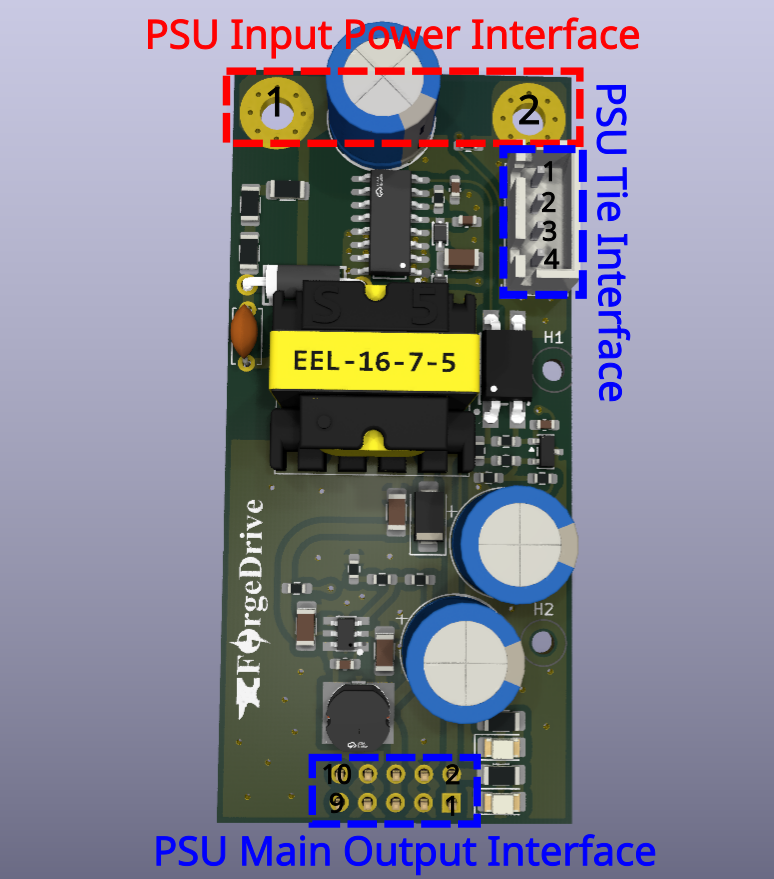

@import "../../forgex_doc_style.css"

# PSU_G0P20N Technical Reference

> **Project:** ForgeX  
> **Generation:** Gen0
> **Document:** PSU_G0P20N Technical Reference  
> **Author:** Omar Magdy  
> **Revision:** Rev. 0  
> **Status:** Development  
> **Date:** August 2026

## Table of Contents
[TOC]

## 1. Introduction

The **PSU (Power Supply Module)** provides the localized low-voltage auxiliary power required by the ForgeX platform. It converts the system **high-voltage DC link**, nominally in the \(340\text{–}400\,\mathrm{VDC}\) range, into regulated low-voltage supplies for downstream electronics and auxiliary circuitry.

The PSU provides the electrical boundary between the VDCH power domain and the low-voltage electronics domain. In addition to power conversion, the module incorporates the local functions required for controlled startup, protection, output regulation, and DC-link voltage monitoring.

The **Gen0 implementation**, `PSU_G0P20N`, establishes the initial electrical, mechanical, and interface definition for the ForgeX PSU family. Subsequent PSU generations may revise the power-conversion topology, switching devices, magnetics, control and regulation architecture, protection mechanisms, or thermal implementation while maintaining the defined ForgeX module interfaces where generational compatibility is required.

The Gen0 design is intentionally optimized for a relatively low-power auxiliary supply, with emphasis on simple magnetics, component availability, ease of debugging, and predictable behavior under the intended ForgeX operating conditions.

---

### 1.1 Naming

`PSU_G0P20N` follows the ForgeX module naming convention:

* `PSU` — Power Supply Module
* `G0` — Generation 0
* `P20` — 20 W nominal power class
* `N` — Non-isolated auxiliary/tie interface variant

The `N` suffix denotes that the module exposes the internal auxiliary supply and the power-side reference through a dedicated **tie interface**. This allows the module to be used in configurations where:

* the internal auxiliary supply is used on the `PGND` side;
* the PSU output-side ground is intentionally referenced to `PGND`;
* the low-voltage outputs are used in a non-galvanically-isolated system configuration

The `P20` designation identifies the intended **power class** of the module and should not be interpreted as an unconditional continuous-power rating. The achievable output power and current depend on operating conditions including:

* VDCH input voltage
* ambient and component temperature
* transformer and semiconductor losses
* PCB thermal characteristics
* enclosure and cooling conditions
* output-voltage loading

---

### 1.2 Functional Overview

The PSU accepts the ForgeX `VDCH` bus as its primary input and generates regulated low-voltage auxiliary supplies for downstream electronics.

The principal functions of the PSU are:

* Generate the primary \(12\,\mathrm{V}\) auxiliary supply.
* Generate the \(5\,\mathrm{V}\) auxiliary supply.
* Provide the required startup and power-conversion functions.
* Provide local protection against abnormal operating conditions.
* Provide output-side monitoring and regulation.
* Provide conditioned measurement of the VDCH bus voltage.
* Provide the required power and signal interfaces to downstream ForgeX modules.
* Maintain the required galvanic isolation between the `VDCH`/power domain and the low-voltage domain for configurations requiring an isolated output.

The module follows the ForgeX design principle of **electrical locality**: functions associated with a power domain are implemented locally within the module rather than being distributed across unrelated system modules.

This includes:

* Power conversion and regulation
* Startup and auxiliary-power generation
* Output monitoring
* Overload and short-circuit protection
* Thermal protection where applicable
* VDCH bus-voltage conditioning
* Local filtering and energy storage

The conditioned VDCH measurement is particularly relevant to applications such as motor drives and power converters, where the controller may require knowledge of the instantaneous DC-link voltage for functions including duty-cycle calculation, modulation limits, protection, or supervisory monitoring.

---

## 2. Interfaces & I/O

The PSU interfaces with the ForgeX system through dedicated **VDCH power**, **low-voltage output**, and **auxiliary/tie** interfaces.

The interfaces are intentionally separated according to their electrical function and power domain.

### 2.1 PSU Input Power Interface

The VDCH input interface provides the primary energy input to the PSU. The interface uses dedicated high-current copper terminals suitable for connection to the ForgeX DC-link distribution structure.

The positive terminal is connected to the system VDCH positive rail, while `PGND` provides the corresponding DC-link return and power-domain reference.

| Pin Number | Pin Name | Pin Description                                             |
| ---------: | -------- | ----------------------------------------------------------- |
|          1 | `VDCH`    | Positive VDCH input. Connects to the positive DC-link rail. |
|          2 | `PGND`   | VDCH return and primary power-domain reference.             |

The input interface shall be treated as a **hazardous-voltage interface** when the PSU is connected to the ForgeX VDCH bus.

---

### 2.2 PSU Main Output Interface

The main output interface provides the regulated low-voltage supplies generated by the PSU.

The interface exposes both \(12\,\mathrm{V}\) and \(5\,\mathrm{V}\) rails together with their corresponding low-voltage ground reference, `LGND`.

The PSU Main Output interface uses a 2.54 mm-pitch header and is compatible with standard IDC and Dupont-style connectors. Multiple pins are paralleled for the power rails and return paths to reduce contact resistance and distribute current across multiple contacts.

A long-pin Dupont header may be used where access to the module's top-layer debug and test points is required.

| Pin Number | Pin Name | Pin Description                               |
| ---------: | -------- | --------------------------------------------- |
|        1–2 | `12V`    | Regulated \(12\,\mathrm{V}\) low-voltage output. |
|        3–4 | `LGND`   | Low-voltage output return/reference.          |
|        5–6 | `5V`     | Regulated \(5\,\mathrm{V}\) low-voltage output.  |
|        7–8 | `LGND`   | Low-voltage output return/reference.          |
|       9–10 | `NC`     | No electrical connection.                     |

`LGND` represents the low-voltage output reference and is electrically distinct from `PGND` in galvanically isolated configurations. In non-isolated configurations, `LGND` and `PGND` may be intentionally referenced together through the system-level grounding/tie arrangement.

---

### 2.3 PSU Non-Isolated Tie Interface

The `N` variant provides a dedicated auxiliary/tie interface exposing selected internal nodes that are not available through the main output connector.

The Non-Isolated Tie interface uses `JST-XH` 2.5 mm-pitch connectors.

This interface permits the PSU to be integrated into systems where the low-voltage auxiliary supply or its reference must be associated with the primary power domain.

| Pin Number | Pin Name           | Pin Description                                                        |
| ---------: | ------------------ | ---------------------------------------------------------------------- |
|          1 | `Internal Aux 12V` | Internal \(12\,\mathrm{V}\) auxiliary output, limited to \(<5\,\mathrm{W}\). |
|          2 | `VDCH_CND`         | Conditioned VDCH bus-voltage measurement output.                       |
|          3 | `PGND`             | Primary power-domain reference.                                        |
|          4 | `PGND`             | Primary power-domain reference.                                        |

`VDCH_CND` is a conditioned analog representation of the `VDCH` DC-link voltage after the PSU's internal voltage-conditioning network. It is intended for connection to a suitable low-voltage ADC or monitoring circuit.

The `PGND` connection on this interface provides access to the primary power-domain reference and shall only be connected according to the intended system-level grounding architecture.

---

## 3. Design Requirements

The Gen0 PSU is designed around the following primary requirements:

* **VDCH input:** \(340\text{–}400\,\mathrm{VDC}\) nominal operating range.
* **Power class:** \(5\text{–}20\,\mathrm{W}\) output operation.
* **Nominal auxiliary rails:** \(12\,\mathrm{V}\) and \(5\,\mathrm{V}\).
* **Efficiency:** \(\geq 85%\) under the intended nominal operating condition.
* Provide controlled startup from the VDCH bus.
* Provide appropriate overload and short-circuit protection.
* Provide regulated low-voltage outputs suitable for ForgeX downstream electronics.
* Provide conditioned VDCH-bus voltage measurement.
* Maintain the required electrical isolation or intentional non-isolated relationship according to the selected system configuration.
* Provide sufficient thermal margin for continuous operation within the intended power class.

The \(20\,\mathrm{W}\) designation represents the intended Gen0 design power class. Detailed continuous-load capability shall be evaluated against the thermal limits of the transformer, switching devices, rectification components, PCB copper, and other dissipative elements.

---

## 4. Constraints

The Gen0 HBM design is subject to several practical constraints.

A significant constraint is the limited local supply chain, with
component availability primarily governed by vendors accessible in
Egypt. Component selection therefore considers availability and
replacement options in addition to electrical performance.

PCB fabrication is constrained by the DFM rules applicable to the
available fabrication process:

* Maximum number of layers: 2
* Minimum track width: 0.25 mm
* Minimum clearance: 0.25 mm
* Minimum polygon-pour clearance: 0.3 mm
* Minimum via diameter: 0.9 mm
* Minimum via hole diameter: 0.4 mm
* Minimum annular ring: 0.5 mm
* Maximum single-board size: 38 cm × 28 cm
* Maximum double-board size: 28 cm × 22 cm

The Gen0 implementation additionally prioritizes:

* Cost effectiveness
* Component availability
* Electrical and mechanical simplicity
* Reliability
* Predictable startup and protection behavior
* Ease of debugging and characterization
* Ease of modification during development
* Maintainability
* Simple and reproducible magnetics
* Compatibility with the broader ForgeX module architecture

Because the PSU interfaces directly with the VDCH bus, the Gen0 implementation also places particular emphasis on controlled voltage stress, switching-node behavior, insulation/isolation requirements where applicable, creepage and clearance, and safe probing during development and validation.

---

## 5. Sizing and Component Selection

This section documents the principal component-selection and sizing decisions of the Gen0 PSU. Component values are selected from the electrical requirements established in the preceding sections, together with the operating characteristics of the selected switching topology and power devices.

Where analytical sizing is insufficient to capture parasitic effects or nonlinear device behavior, the initial component values are supplemented by simulation and experimental characterization.

### 5.1 Off-line Switcher

The **VIPer26** off-line switcher from the STMicroelectronics VIPerPlus family was selected as the primary switching controller and integrated power device.

**Datasheet:** [VIPer26LD](https://www.st.com/resource/en/datasheet/VIPER26.pdf)

**Selection rationale:**

* **Local availability and cost:** The device is readily available from local suppliers at relatively low unit cost, making it practical for prototyping, production, and replacement.
* **Integrated high-voltage MOSFET:** The integrated MOSFET provides an \(800\,\mathrm{V}\) maximum drain-source voltage rating, providing substantial voltage margin relative to the intended `VDCH` operating range and associated switching transients.
* **Application-appropriate conduction characteristics:** The integrated MOSFET has an on-state resistance in the order of \(7\,\Omega\), which is suitable for the relatively low primary current associated with the \(5\text{–}20\,\mathrm{W}\) PSU power class.
* **Low switching-node capacitance:** The relatively low effective output capacitance of the integrated MOSFET reduces switching-node capacitive energy and associated switching losses.
* **Integrated control and protection:** The device integrates startup, PWM control, current limiting, burst-mode operation, and associated protection functions.
* **Integrated current sensing:** Primary current is sensed internally through the integrated SenseFET structure, eliminating the need for a conventional external primary-side current-sense resistor.
* **Frequency jittering:** The integrated switching-frequency jitter function reduces the concentration of switching energy at a single frequency and can reduce EMI peaks.
* **Low standby consumption:** Integrated low-power operating modes reduce consumption under light-load conditions.

The integrated switching, control, sensing, startup, and protection functions result in a compact implementation with substantially reduced external component count.

Although the application is not a conventional mains-powered offline supply, the input-voltage range and required operating conditions are within the intended application domain of the device. The VIPer26 therefore provides a suitable integrated switching solution for the ForgeX PSU.

The Gen0 implementation follows the **isolated flyback application topology** presented in the VIPer26 datasheet.

### 5.2 Flyback Transformer

The flyback transformer is the primary energy-storage, energy-transfer, and
galvanic-isolation element of the PSU.

Unlike a conventional power transformer, the flyback transformer stores a
substantial fraction of the transferred energy in its magnetizing inductance
during the primary conduction interval and subsequently transfers this energy
to the secondary during the demagnetization interval.

The design methodology follows the general procedure described in
[Designing a DCM flyback converter](https://www.ti.com/lit/ta/ssztcw6/ssztcw6.pdf?ts=1787114658344&ref_url=https://www.google.com/),
with modifications to the order and priority of the design constraints to
reflect the requirements of the ForgeX PSU.

The transformer design is constrained by:

* `VDCH` operating-voltage range
* Required output power
* Selected switching frequency
* Maximum primary peak current
* Target operating mode
* Allowable flux density
* Required primary magnetizing inductance
* Selected turns ratio
* Allowable leakage inductance
* Winding current density
* Insulation and creepage requirements
* Thermal constraints

The transformer design establishes the primary magnetizing inductance,
maximum stored energy per switching cycle, reflected secondary voltage,
MOSFET voltage stress, secondary-device voltage stress, and the resulting
flyback operating regime.

The initial electrical parameterization is performed before physical core
and winding selection. The resulting electrical requirements are then passed
to the magnetic design stage, where the core, number of turns, air gap,
winding geometry, leakage inductance, and thermal characteristics are
determined.

The \(150\,\mathrm{V}\) maximum reflected-voltage constraint is selected
from the available voltage margin of the VIPer26 integrated MOSFET.

At the maximum VDCH input voltage, the idealized MOSFET drain-source voltage
is approximately:

\[
V_{DS} \approx V_{in,max} + V_R
\]

Additional voltage stress is introduced by leakage-inductance-induced
switching overshoot. For the initial design, a \(100\,\mathrm{V}\) allowance
is reserved for this overshoot:

\[
V_{DS,max}
\approx
400\,\mathrm{V}
+
150\,\mathrm{V}
+
100\,\mathrm{V}
=
650\,\mathrm{V}
\]

This provides an initial voltage margin below the \(800\,\mathrm{V}\) MOSFET
rating. The actual leakage-induced overshoot and resulting voltage margin
are subsequently verified using the final transformer leakage inductance
and RCD clamp design.

**Primary Inductance and Turns Ratio**

The initial flyback electrical parameterization is performed by first
establishing the reflected-voltage constraint and turns ratio, followed by
selection of the maximum operating duty cycle and corresponding primary peak
current.

\[
\begin{aligned}
f_{sw} &= 60\,\mathrm{Khz} \quad \text{(Switcher fixed switching frequency)}
\\[4pt]
V_{R_{max}} &= 150\,\mathrm{V} \quad \text{(Maximum tolerable secondary-to-primary reflected voltage)}
\\[4pt]
\frac{N_p}{N_s} &= 8
\\[4pt]
V_R &= (V_{out}+V_d)\times\frac{N_p}{N_s} = 99.2\,\mathrm{V}
\\[4pt]
I_{lim} &= 0.7\,\mathrm{A} \quad \text{(Controller peak-current limit)}
\end{aligned}
\]

For DCM operation, the switching period consists of three distinct
intervals:

\[
\begin{aligned}
T_s &= \frac{1}{f_{sw}} = 16.67\,\mu\mathrm{s}
\\[4pt]
T_s &= t_{1}+t_{2}+t_{3}
\\[4pt]
T_s &> t_{1}+t_{2}
\\[4pt]
D &= \frac{t_{1}}{T_s}
\end{aligned}
\]

where:

\[
\begin{aligned}
t_{1} &: \text{Primary switch ON; magnetizing current ramps up.}
\\[4pt]
t_{2} &: \text{Primary switch OFF; secondary conducts and transfers stored energy.}
\\[4pt]
t_{3} &: \text{Both primary and secondary currents are zero.}
\end{aligned}
\]

The boundary between DCM and CCM occurs when the demagnetization interval
exactly occupies the remainder of the switching period:

\[
\begin{aligned}
D_{crit} &= \frac{V_R}{V_{in,min}+V_R} = \frac{99.2}{340+99.2} \approx0.226
\end{aligned}
\]

The maximum operating duty cycle is selected below this boundary to maintain
DCM operation at the minimum `VDCH` input voltage:

\[
D_{max}\approx0.2
\]

Therefore:

\[
D_{max}<D_{crit}
\quad\text{(DCM operation at }V_{in,min}\text{)}
\]

With the maximum duty cycle selected as a design constraint, the required
primary peak current is determined from the desired output power:

\[
\begin{aligned}
P_{out}&=20\,\mathrm{W}
\\[4pt]
\eta&=0.85
\\[4pt]
I_{pk}&=\frac{2P_{out}}{\eta V_{in,min}D_{max}}\approx0.692\,\mathrm{A}
\end{aligned}
\]

The required primary magnetizing inductance is then selected to store the
required energy per switching cycle at the selected peak current:

\[
L_m=\frac{2P_{out}}{\eta I_{pk}^2f_{sw}}\approx1.6\,\mathrm{mH}
\]

The resulting peak current remains below the controller current limit:

\[
I_{pk}<I_{lim}
\]

The resulting \(L_m\), \(I_{pk}\), \(D_{max}\), and turns ratio are passed to
the subsequent magnetic design stage.

**Magnetics Design**

### 5.3 RCD Clamp

An RCD clamp is used to limit the primary switching-device voltage excursion caused by transformer leakage inductance.

When the primary switch turns off, the magnetizing current is interrupted while current associated with the transformer leakage inductance cannot change instantaneously. The resulting leakage energy produces a voltage excursion at the primary switching node.

The RCD network provides a controlled path for this leakage energy, converting the stored leakage energy primarily into heat in the clamp resistor while limiting the resulting `VDCH`-referenced voltage stress on the integrated MOSFET.

The initial RCD clamp values are obtained using empirical flyback-snubber design relationships and are subsequently verified using circuit simulation and experimental measurements.

The design primarily considers:

* maximum `VDCH`;
* maximum primary peak current;
* transformer leakage inductance;
* switching frequency;
* reflected secondary voltage;
* desired clamp voltage;
* allowable MOSFET voltage stress;
* clamp-capacitor voltage ripple;
* clamp-resistor dissipation; and
* PCB and transformer parasitic inductance.

The initial sizing follows the methodology described in [Application Note AN-4147](https://e2e.ti.com/cfs-file/__key/communityserver-discussions-components-files/188/Design-Guidelines-for-RCD-Snubber-of-Flyback-Converters_2D00_Fairchild-AN4147.pdf).

For the initial design, transformer leakage inductance is assumed to be approximately \(1\%\) of the primary magnetizing inductance:

\[
L_{lk}=0.01L_m=0.01\times1.6\,\mathrm{mH}\approx16\,\mu\mathrm{H}
\]

This value is used as an initial design assumption. The actual leakage inductance is determined by the final transformer construction and subsequently verified experimentally.

The preliminary clamp design uses:

\[
\begin{aligned}
L_m&=1.6\,\mathrm{mH} \\[4pt]
L_{lk}&=16\,\mu\mathrm{H} \\[4pt]
V_o&=12\,\mathrm{V} \\[4pt]
V_d&=0.4\,\mathrm{V} \\[4pt]
\frac{N_p}{N_s}&\approx8 \\[4pt]
I_{pk}&=0.692\,\mathrm{A} \\[4pt]
f_s&=60\,\mathrm{kHz}
\end{aligned}
\]

The reflected secondary voltage established by the transformer design is:

\[
V_R=(V_o+V_d)\frac{N_p}{N_s}\approx99.2\,\mathrm{V}
\]

For the initial RCD design, the clamp voltage is selected according to the empirical relationship:

\[
V_{sn}=2\times nV_o=198.4\,\mathrm{V}
\]

The energy stored in the transformer leakage inductance at primary switch turn-off is:

\[
E_{lk}=\frac{1}{2}L_{lk}I_{pk}^2
\]

The corresponding average snubber dissipation is estimated using the empirical RCD relationship:

\[
P_{sn}=\frac{1}{2}L_{lk}I_{pk}^2\frac{V_{sn}}{V_{sn}-V_{R}}f_s\approx0.47\,\mathrm{W}
\]

The corresponding clamp resistance is:

\[
R_{sn}=\frac{V_{sn}^2}{P_{sn}}\approx84\,\mathrm{k\Omega}
\]

For an initial clamp-capacitor value of:

\[
C_{sn}=2.2\,\mathrm{nF}
\]

the estimated clamp-voltage ripple is:

\[
\Delta V_{sn}=\frac{V_{sn}}{R_{sn}f_sC_{sn}}\approx17.9\,\mathrm{V}
\]

The resulting component values are used as the initial simulation values. The final RCD network is subsequently tuned against the simulated and measured primary switching waveform.

Particular attention is given to:

* MOSFET maximum \(V_{DS}\)
* leakage-induced voltage overshoot
* clamp-voltage ripple
* snubber power dissipation
* switching-node ringing
* transformer leakage-inductance variation
* PCB parasitic inductance

The final clamp voltage is selected with sufficient margin below the \(800\,\mathrm{V}\) MOSFET rating while avoiding unnecessary snubber dissipation.
### 5.4 Input Capacitor, Output Capacitor, and Output Diode

The input capacitor provides the local energy reservoir for the primary-side converter and limits the high-frequency current drawn from the `VDCH` distribution network.

The output capacitor stores the energy delivered by the secondary winding and supplies the load during the interval in which the secondary rectifier is not conducting.

The output rectifier is selected according to:

* maximum reverse voltage
* peak forward current
* average forward current
* reverse-recovery characteristics
* forward-voltage drop
* switching frequency 
* thermal dissipation

The capacitor and rectifier sizing considers both steady-state electrical requirements and transient operating conditions.

The principal sizing relationships are given below.

**Output Diode**
\[
\begin{aligned}
I_{out} &= \frac{P_{out}}{V_{out}} = \frac{20}{12} = 1.67\,\mathrm{A} \\[4pt]
P_{Diode} &= V_{d} \times I_{out} = 0.668\,\mathrm{W} ;\quad V_{d} \approx0.4\,\mathrm{V}\,\text{(Schottky)} \\[4pt]
I_{Diode,pk} &= I_{pk} \times \frac{N_p}{N_s} = 0.66 \times 8 = 5.28\,\mathrm{A} \\[4pt]
\end{aligned}
\]

**Output Capacitor**
\[
\begin{aligned}
C_{out,min} &= \frac{I_{out,max} (1 − D_{min})}{(\Delta V_{out} − I_{pk} \frac{Np}{Ns} R_{esr}) f_{sw}} \\[20pt]
I_{Cout,rms} &= \sqrt{I_{sec,rms}^2 - I_{out}^2} = \sqrt{\frac{I_{pk}^2 \left(\frac{N_p}{N_s}\right)^2 t_2 f_{sw}}{3} - I_{out,max}^2}\\[12pt]
&= 2\,\mathrm{A}\\[12pt]
t_2 &= 
\frac{L_m I_{pk}}
{\left(\frac{N_p}{N_s}\right)(V_{out}+V_D)} = 11.976\, \mu \mathrm{s}
\end{aligned}
\]

The output ripple contribution due to ESR is:
\[
\Delta V_{out,ESR}=I_{pk}\times\frac{N_p}{N_s}\times R_{esr}
\]

For example, with \(I_{pk}=0.66\,A\), \(N_p/N_s=8\), and \(R_{esr}=30\,m\Omega\):
\[
\Delta V_{out,ESR}=0.158\,V_{pp}
\]

Therefore, for a \(0.3\,V_{pp}\) ripple target, \(C_{out,min} = 161\,\mu\mathrm{F}\).

### 5.5 Feedback and Compensation

The feedback network establishes regulation of the PSU output and determines the small-signal response of the converter.

The control-loop design considers:

* flyback power-stage dynamics
* operating mode

A small-signal model of the converter is derived and used to establish the control-to-output transfer function.

The resulting model is used to determine the required compensation network and verify loop stability across the expected operating range.

\[
\text{[Small-signal power-stage model]}
\]

\[
\text{[Control-to-output transfer function]}
\]

\[
\text{[Compensation design]}
\]

The analytical model is subsequently compared against circuit simulation and experimental frequency-response measurements where applicable.

### 5.6 Primary Switch Loss Estimation

The primary switch losses are initially estimated at the principal
operating-voltage extremes.

**At \(V_{in}=340\,\mathrm{V}\): Maximum-duty operating point**

For the triangular primary current waveform associated with DCM operation,
the RMS primary current during the switching period is:

\[
\begin{aligned}

I_{pk,rms}
&=
I_{pk}
\sqrt{\frac{D_{max}}{3}}
\\[4pt]

I_{pk,rms}
&\approx
170\,\mathrm{mA}
\end{aligned}
\]

The corresponding MOSFET conduction loss is estimated using the integrated
MOSFET on-resistance:

\[
\begin{aligned}

P_{FET,cond}
&=
I_{pk,rms}^2\times R_{DS(on)}
\\[4pt]

P_{FET,cond}
&=
0.17^2\times7\,\Omega
\\[4pt]

P_{FET,cond}
&\approx
0.2\,\mathrm{W}

\end{aligned}
\]

The nonlinear MOSFET output capacitance is represented using a fitted
\(C_{oss}(V)\) characteristic derived from the device datasheet:

\[
\begin{aligned}

Q_{Fet}(V)
&=
580\,\mathrm{pC}\times V^{0.443}
\\[4pt]
\end{aligned}
\]

For a nonlinear output capacitance, the stored capacitive energy is
determined from the charge-voltage characteristic:

\[
\begin{aligned}
E_{oss}(V) &= \int_0^V V'\,dQ_{oss}(V') = 178\,\mathrm{p} \times V^{1.443}\,\mathrm{J}
\end{aligned}
\]

The corresponding first-order capacitive switching-loss estimate is:

\[
\begin{aligned}

P_{FET,Coss}
&=
f_{sw}\times E_{oss}(V_{in}) = 48\,\mathrm{mW}

\end{aligned}
\]

The switching-loss contribution associated with the active turn-on and
turn-off transitions is initially approximated as being comparable to the
MOSFET conduction loss. This assumption is used only for the preliminary
thermal estimate and is subsequently refined using switching-waveform
simulation.

Therefore:

\[
\begin{aligned}

P_{FET,total}
&\approx
P_{FET,Coss}
+
P_{FET,cond}
+
P_{FET,switching}
\\[4pt]

P_{FET,total}
&\approx
0.45\,\mathrm{W}

\end{aligned}
\]

**At \(V_{in}=400\,\mathrm{V}\): Minimum-duty operating point**

The primary ON-time becomes:

\[
\begin{aligned}

D &= \frac{2P_o}{\eta V_{in} I_{pk}} \approx 0.178 \\[4pt]
I_{p,rms} &\approx 160\,\mathrm{mA} \\[4pt]
P_{FET,cond} &= 0.16^2\times7\,\Omega \approx 0.18\,\mathrm{W} \\[4pt]
P_{FET,Coss} &\approx 60\,\mathrm{mW}
\end{aligned}
\]

Using the same preliminary switching-loss assumption:

\[
\begin{aligned}

P_{FET,total}
&\approx
0.42\,\mathrm{W}

\end{aligned}
\]

The preceding loss calculations represent preliminary first-order estimates.
Final MOSFET loss is verified against the simulated switching waveform,
including the effects of drain-voltage overshoot, leakage inductance,
switching transition time, and the RCD clamp.

### 5.7 Preliminary Electrical Design Results

The preceding parameterization establishes the principal electrical
requirements imposed on the flyback transformer:

| Parameter | Preliminary value |
|---|---:|
| Switching frequency | \(60\,\mathrm{kHz}\) |
| VDCH design input range | \(340\text{–}400\,\mathrm{V}\) |
| Output voltage | \(12\,\mathrm{V}\) |
| Output power | \(20\,\mathrm{W}\) |
| Maximum design peak current | \(0.66\,\mathrm{A}\) |
| Controller current limit | \(0.7\,\mathrm{A}\) |
| Maximum reflected voltage | \(99.2\,\mathrm{V}\) |
| Calculated reflected voltage | \(198.4\,\mathrm{V}\) |
| Initial turns ratio | \(\approx 8:1\) |
| Primary magnetizing inductance | \(\approx 1.8\,\mathrm{mH}\) |
| Operating mode at \(340\,\mathrm{V}\) | DCM |

---

## 6. Layout Considerations & Highlights

---

## 7. Design Files

The complete hardware design files for this module are maintained in the ForgeX repository:

**revA:**
- [PCB & Schematic](https://github.com/Omar-Magdy0/ForgeDriveHW/tree/main/ForgeX/PSU_G0P20N/revA)
- [Simulation](https://github.com/Omar-Magdy0/ForgeDriveHW/tree/main/ForgeX/PSU_G0P20N/revA/Doc/simulation)
- **Manufacturing files:** 🛠️

---

## 8. Simulation

Simulation is used as a first-pass validation and design tool for the
HBM.

The simulations are intended to:

- Validate initial electrical estimates
- Evaluate the effects of layout-related parasitics
- Assist with component sizing
- Investigate switching behavior and transient effects
- Provide a basis for first-pass design tuning

Simulation results are not considered a substitute for physical testing
and validation. Their accuracy depends on the quality, fidelity, and
applicability of the underlying semiconductor, parasitic, and system
models.

The primary simulation focus is the power-electronics behavior of the
module and its associated switching infrastructure.

The following test circuits are provided under `simulation/`

- **Switching Model :**
`PSU_G0P20N.asc`

- **Small Signal Model :**
`PSU_G0P20N_SS.asc`

**Digest and Conclusion**

---

## 9. Field Tests and Validation 🛠️

[Document laboratory testing, measurements, test conditions, and
comparison against simulation.]

---

## 10. Known Issues and Limitations 🛠️

[Document known limitations of Rev. A / Gen0.]

---

## 11. Revisions

| Revision | Date | Description |
|---|---|---|
| Rev. 0 | August 2026 | Initial technical reference |